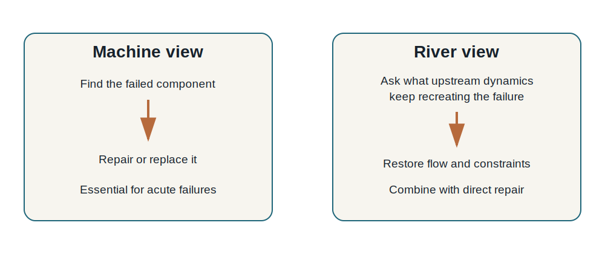
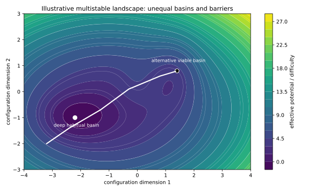
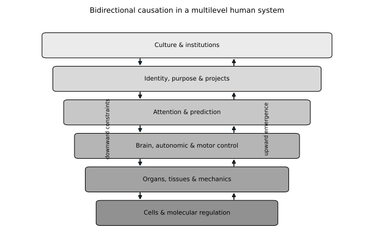
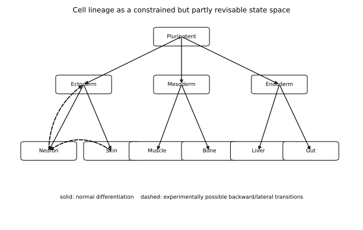
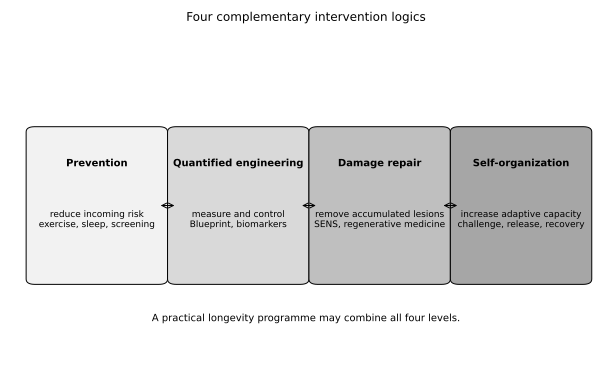
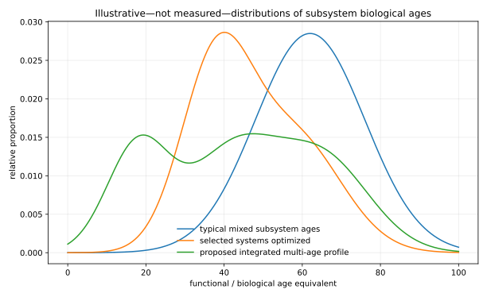
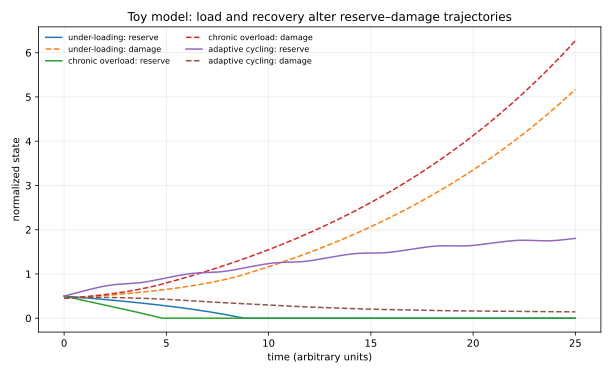

# Part I — Learning to See Complex Systems

---

# Chapter 1 — The River, the Machine, and the System

Modern medicine learned to see the body as a machine, and humanity benefited enormously. The mechanical image encouraged anatomists to identify parts, surgeons to repair structures, physiologists to isolate functions, and pharmacologists to target pathways. A heart could be understood as a pump, a joint as a bearing, a nerve as a cable, and a disease as the failure of a component. When a component is blocked, infected, torn, or malignant, this way of thinking can save a life.

The problem is not that the machine metaphor is false. The problem is that it is incomplete. A machine is normally assembled by an external agent. A living body assembles itself. A machine does not heal a scratch, remodel its supports after load, learn a new gait, or begin as a single cell and construct a nervous system. Even the most advanced engineered machines do not continually replace their own matter while preserving a coherent identity.

A river offers a complementary metaphor. A river persists although its water is never the same. Its form depends on a watershed, gradient, banks, sediment, rainfall, vegetation, animals, and human intervention. If a river is polluted, we can remove waste downstream. We can also stop the pollution at its source, reopen blocked tributaries, restore wetlands, and allow flow to reorganize the channel. One strategy removes damage. The other restores the dynamics that prevent damage from being recreated.

This distinction becomes concrete in a human body. Consider persistent tension around the jaw and neck. The mechanical question asks which muscle, joint, tooth, or nerve is defective. That question is indispensable. The systems question asks what keeps reproducing the pattern. Vision, breathing, pain prediction, sleep, work posture, learned bracing, social stress, and old injury may all contribute. A therapist may release one muscle; the organism may tighten it again tomorrow because the larger organization has not changed.

The word *system* is often used loosely. Here it has a precise minimum meaning: a collection of interacting components whose behaviour depends on their relations, not only on the properties of each component in isolation. A pile of heart cells is not a heart. A list of neurons is not a memory. A crowd can become a queue, a market, an audience, or a panic without changing the individuals present. Organization alters what the parts can do.

General systems theory, cybernetics, and later complexity science developed languages for these situations [@bertalanffy1968general; @ashby1956cybernetics]. They asked how feedback stabilizes behaviour, how patterns emerge from local interactions, how systems adapt to perturbation, and why wholes sometimes possess regularities that cannot be read directly from a list of parts. These questions now appear across physics, ecology, economics, neuroscience, and biology.

The river metaphor should not be romanticized. A river cannot regrow every destroyed structure. A body with a severed tendon, bacterial infection, retinal detachment, or malignant tumour may need immediate targeted intervention. A systems view does not replace component-level medicine. It nests it inside a wider question:

> When a living system repeatedly recreates a problem, what organization makes that problem stable?

That question is the entrance to the book. It shifts attention from the body as a finished object to the body as an active process. The next chapters supply the concepts needed to make that shift rigorous rather than metaphorical.

{width=88%}

## Why metaphors matter

Scientific metaphors are not decoration. They determine which questions appear natural. When William Harvey described circulation in mechanical terms, the image of pumps and pipes opened a productive programme. When information theory entered genetics, researchers began asking how sequences encode and transmit. Every metaphor reveals and conceals.

The machine metaphor reveals localization, reliability, and repair. It conceals self-production, context, and historical adaptation. The river metaphor reveals flow and upstream causes. It conceals the discrete, highly differentiated architecture of organs. Systems biology attempts to move beyond choosing one metaphor by building models that include components, flows, feedback, and hierarchy.

For the reader, this means resisting false choices. A torn ligament is not “only a pattern,” and chronic pain is not always reducible to a torn ligament. The mature question is which description is useful at which scale.

## From parts lists to interaction maps

A reductionist description might list the muscles of the neck. A systems description adds their reciprocal activation, sensory feedback, relation to vision and vestibular control, habitual work posture, and the expectations that precede movement. This does not make the system unknowable. It changes the unit of explanation from isolated parts to networks and dynamics.

Modern systems biology uses interaction graphs, differential equations, control theory, and multiscale simulation. Yet the conceptual move precedes the mathematics: a property of the whole may depend on a pattern distributed across many parts. This is the same move a reader makes when understanding a sentence. The meaning is not located in one word; it arises from relations among words and prior knowledge.

## Health as a capacity, not a snapshot

A static measurement can look normal while adaptive capacity is declining. Blood glucose may be acceptable at rest but respond poorly to a meal. Balance may look adequate until the surface changes. A person may appear psychologically stable because life has become narrow enough to avoid challenge.

A systems view therefore asks how the organism responds to perturbation. Can it leave equilibrium, solve a demand, and return without accumulating damage? This is the beginning of resilience science and the reason later chapters focus on recovery kinetics and “improved improvability.”

---

# Chapter 2 — Configuration Space, Attractors, and Landscapes

To understand a body as a dynamical system, we need a way to describe not just what it is, but the different states it could occupy.

Imagine describing a simple pendulum. Its complete state requires at least its angle and angular velocity. Every possible combination of those variables is a point in a **state space**. As time passes, the pendulum traces a path through that space. Friction causes many different initial paths to converge toward rest. The resting state is an attractor: a state or family of states toward which nearby trajectories tend to move.

A human body has vastly more variables. Joint angles, muscle activation, tissue stiffness, blood pressure, immune state, hormone levels, gene expression, expectations, and social context all change over time. We cannot draw the complete space. Nevertheless, the concept helps us avoid a common mistake: treating the current configuration as the only possible one.

An attractor is not necessarily healthy. A person with chronic pain may occupy a stable pattern of guarding, shallow breathing, reduced activity, and threat expectation. Each component reinforces the others. A small improvement may fade because the system returns to the familiar basin. Similarly, a society can remain trapped in an inefficient institution because laws, expectations, investments, and identities mutually stabilize it. In physics, a material may remain in a metastable state because a barrier separates it from a lower-energy arrangement.

The image of a landscape is useful. Valleys represent stable regimes; ridges represent barriers. But the landscape of a living system is not a fixed row of identical hills. It is irregular, multidimensional, and itself modified by the system’s history. Practice deepens some valleys and shallows others. Injury, culture, learning, and age reshape the terrain.

{width=86%}

Three ideas follow.

First, **stability is not the same as health**. A rigid posture can be stable. A depressive pattern can be stable. A tumour can be locally self-maintaining. Systems biology asks which attractor a system occupies, not merely whether its variables are constant.

Second, change may require crossing a barrier. In chemistry, a reaction can be favourable yet fail to occur because activation energy is required. In the body, a healthier movement may be mechanically possible yet inaccessible because pain prediction, co-contraction, fear, and habit create a barrier. Relaxation may lower the barrier by releasing constraints. Progressive challenge may supply the perturbation needed to cross it.

Third, healthy states are usually not one point. There is no single ideal human posture, metabolism, or personality. Health is better represented by a **viable region**: a set of configurations from which the organism can respond, recover, and continue adapting. This is why resilience matters more than a perfect snapshot.

Mathematically, a simplified one-dimensional system can be written as

\[
\frac{dx}{dt}=-\frac{dV(x)}{dx}+u(t)+\eta(t),
\]

where \(x\) is the system state, \(V(x)\) is an effective landscape, \(u(t)\) is a purposeful intervention, and \(\eta(t)\) represents fluctuations. The equation says that the system tends to move downhill in its current landscape, while interventions and fluctuations can alter its path.

The equation is not a model of the whole body. Its value is pedagogical. It separates three questions: What states are locally stable? What barriers separate them? What perturbation changes the trajectory? In later chapters we will replace the single variable with interacting levels and ask whether aging deepens rigid attractors while practice reopens configuration space.

## Building intuition with a familiar example

Consider learning to ride a bicycle. At first, the rider’s state wanders through many unstable combinations of steering, body lean, speed, and fear. With practice, a coordinated regime emerges. Once established, small disturbances are corrected automatically. The skill has become an attractor in sensorimotor state space.

Now imagine an injury. The rider protects one side and develops a compensatory pattern. Repetition deepens the new basin. Even after tissue healing, the protective attractor can remain because it has become the system’s easiest solution.

This example explains why “just relax” or “just stand straight” often fails. The current state is not maintained by a single conscious decision. It is the endpoint of many mutually consistent variables.

## Landscapes are effective descriptions

In physics, potential energy can sometimes be measured directly. In biology, an attractor landscape is often an effective representation. Its valleys summarize how thousands of molecular, neural, mechanical, and social variables jointly shape likely trajectories.

We should not imagine a literal topographic surface inside the body. The usefulness of the landscape lies in asking whether an intervention changes the state, the barrier, or the landscape itself. A painkiller may temporarily move the state. Motor learning may reshape the basin. Surgery may remove a structural barrier. A change of work or identity may alter the higher-level constraints that keep the old landscape in place.

## Critical transitions

Complex systems sometimes change gradually and then suddenly. Before a transition, recovery from perturbation may slow, variability may increase, and correlated fluctuations may spread across variables. These ideas, studied in ecology and physiology, suggest practical measurements for structural reorganization. If the body approaches a new attractor, does movement variability change before posture shifts? Does the recovery time after a practice session shorten or lengthen?

This is how an analogy becomes a research programme.

---

# Chapter 3 — Emergence, Feedback, and Downward Causation

Complex systems are often introduced through **emergence**: large-scale patterns produced by interactions among smaller components. Water molecules do not individually contain a wave. Birds following local rules can form a flock. Buyers and sellers produce market prices that no participant directly commands. Neurons produce perception through coordinated activity.

Emergence is only half of the story. Once a higher-level pattern exists, it changes the conditions experienced by the parts. This influence is commonly called **downward causation** or **top-down causation** [@ellis2012topdown; @noble2012biological]. The term does not imply a mysterious force descending from a separate realm. It means that the state of a larger organization constrains lower-level interactions.

A physical example is a crystal. The lattice structure constrains the energy states available to electrons. The lattice is made of atoms, yet once formed it affects how those atoms and electrons behave. In fluid dynamics, the geometry of a container constrains possible flows. In a computer, software is physically implemented by electronics, but the running program determines which circuits switch at a given moment.

A social example is a university. It consists of people, buildings, documents, and machines. Yet the institution constrains individuals through roles, schedules, standards, budgets, and expectations. A professor’s actions cannot be predicted from neurons alone; they depend on the lecture, the curriculum, and the meaning of the role. The institutional level is not independent of people, but it is causally relevant.

The human body is a hierarchy of such constraints. A project changes attention and daily behaviour. Behaviour changes sleep, movement, nutrition, and social interaction. These alter autonomic, endocrine, immune, and mechanical signals. Cells respond by changing metabolism, gene expression, proliferation, and matrix production. The high-level purpose is implemented molecularly, but its causal description cannot be replaced by listing molecules.

{width=82%}

Feedback closes the loop. Better movement changes sensory evidence, which changes prediction and confidence, which makes better movement more likely. Chronic pain can form the opposite loop: anticipated pain increases guarding, guarding redistributes load, load increases irritation, and irritation confirms the expectation.

This is where belief becomes biologically relevant without magical thinking. A belief is not merely a sentence. It is a stable expectation that influences attention and action. “I am fragile” changes which movements are attempted and how they are performed. Over years, the resulting loads alter tissues. Culture enters the body through repeated constraints.

Downward causation also clarifies the proposed role of practice. Meditation or Tai Chi does not directly instruct a chromosome to rejuvenate. It changes high-level constraints: attention, threat prediction, voluntary control, breathing, movement, and daily behaviour. Those changes propagate through ordinary physiological pathways. The open empirical question is how deep and how far the cascade can go.

The strongest version of the framework therefore does not oppose bottom-up biology. It proposes **causal closure across levels**: molecules enable tissues; tissues enable organisms; organisms create contexts that regulate molecules. No single level is always the true cause. The useful level depends on the question.

## Downward causation is not downward magic

Critics sometimes object that because higher levels are made of lower levels, all causation must ultimately be bottom-up. This confuses implementation with explanation. A traffic law is implemented through human nervous systems, engines, roads, and signals. Yet the law changes traffic because people interpret and enforce it. Removing the legal level would make prediction worse, not more scientific.

Similarly, the statement “stress changes gene expression” does not claim that an abstract idea bypasses chemistry. It identifies a causal chain whose higher-level description carries information that a molecular list omits.

## Constraint as a mechanism

Higher levels often act by restricting possibilities rather than supplying force. A container does not push every fluid molecule into a vortex; its geometry limits possible flows. A social institution does not control every thought; it restricts roles and incentives. A tissue boundary constrains cell migration. A belief constrains which actions are attempted.

This is why the language of **constraint** is central. Downward causation is frequently the propagation of boundary conditions through a hierarchy.

## The body as a society of cells

Multicellular life can be viewed as an ancient social contract. Cells surrender unlimited reproduction, specialize, exchange resources, and accept coordinated death. Cancer is partly a breakdown of this cooperation. The organism-level pattern constrains each cell, while cells maintain the organism that constrains them.

The analogy with society is imperfect but illuminating. A healthy society cannot be understood by psychology alone, and a healthy body cannot be understood by molecular biology alone. In both cases, institutions or tissues stabilize collective identities that feed back on components.

---

# Chapter 4 — Organization, Information, and Identity

A living body remains recognizably itself while replacing much of its material. This is possible because identity is carried not only by components but by patterns of relation.

Neural memory offers a familiar example. A memory is not generally stored in one privileged neuron. It is distributed across changes in synaptic strength, excitability, timing, and network organization. Individual molecular components turn over. Some neurons can be lost without deleting the memory. Conversely, preserving every neuron would not preserve memory if their organization were scrambled.

The same distinction appears in a city. Buildings change, residents move, institutions evolve, yet the city persists through networks, functions, records, and spatial organization. Identity is neither completely material nor detached from matter. It is a maintained pattern instantiated in changing material.

In biology, this idea is related to autopoiesis: the organism continually produces the components that maintain the organization capable of producing them [@maturana1980autopoiesis]. It is also related to information, though that word must be used carefully. DNA contains sequences that influence protein production, but the meaning of a gene depends on the cell, developmental stage, chromatin state, signals, and tissue geometry. Biological information is contextual and distributed.

This matters for repair. If a function is distributed, restoration may not require historical identity at the microscopic level. A collateral blood vessel can partly replace a blocked route. A surviving neural circuit can assume some function of a damaged region. Different muscles can produce a similar movement. Biology often uses **degeneracy**: structurally different elements generate comparable outcomes.

Approximate equivalence is not unlimited. A replacement must satisfy the relevant constraints. A sensory pathway requires accurate connectivity. A heart valve must tolerate pressure. The argument is not that any component can replace any other. It is that exact replay of developmental history may not always be necessary for functional restoration.

Identity also exists at multiple levels. Biological identity—the maintenance of a bounded, viable organism—preceded psychological identity by billions of years. Psychological identity organizes autobiography, values, and expectation. Social identity places the person in families and institutions. These layers can support one another, but rigidity at a higher layer can restrict biological adaptation.

The longevity paradox follows. People often seek longevity to preserve their current identity. Yet a living system survives through controlled transformation. If “who I am” becomes a prohibition against changing movement, occupation, relationships, beliefs, or routines, psychological continuity can oppose biological continuity.

An adaptive identity preserves commitments and purpose while allowing implementation to change. The river persists not by preserving each water molecule but by maintaining a coherent trajectory through change.

---

# Chapter 5 — Evolution: How Open-Ended Form Arises

The self-organizing body is not infinitely plastic. Its possibilities are shaped by evolution.

Natural selection begins with a simple logic. Populations contain heritable variation. Organisms differ in survival and reproduction. Variants that contribute to reproductive success tend, on average, to become more common. Across many generations, this process produces adaptations without a foresighted designer [@darwin1859origin].

Several qualifications matter. Evolution does not optimize every trait independently. It works with inherited structures, trade-offs, historical accidents, and changing environments. A feature can persist because it is good enough, because changing it would disrupt other functions, or because selection weakens after reproduction. Sexual selection, kin selection, developmental constraints, and niche construction further complicate the picture.

Bodies are therefore not perfect machines. They are evolving compromises. The human spine reflects a quadrupedal ancestry. Cancer suppression limits regenerative proliferation. Immune systems balance defence against autoimmunity. Aging can emerge partly because maintenance sufficient for development and reproduction was favoured more strongly than indefinite repair [@kirkwood2005odd].

Yet evolution also produced remarkable robustness. Embryos develop reliably despite molecular noise. Wounds close. Bones adapt to load. Immune systems learn. Behaviour modifies environments. Evolution selected not one fixed adult form but developmental and regulatory systems capable of producing viable forms across variable conditions.

This is crucial for the healthy-attractor idea. Healthy humans vary genetically and environmentally, yet they occupy a constrained region of morphology. We all recognize a human body because developmental mechanisms repeatedly converge on related solutions. A self-organizing adult body will not invent wings or a new organ plan through meditation. Its accessible forms are constrained by evolutionary and developmental history.

The proposal that recovery tends toward an “original” organization should therefore be understood statistically. When chronic compensation is removed, the body is more likely to move toward configurations compatible with the same developmental architecture that produced it than toward arbitrary novelty. The basin is broad, not a single blueprint.

Evolution also suggests why latent regenerative mechanisms may be inhibited. Once a structure is functional, unrestricted plasticity can be dangerous. Growth consumes energy, destabilizes identity, and increases cancer risk. A developmental programme may be silenced not because the underlying chemistry is impossible, but because stability became more valuable than continued exploration.

This possibility does not prove that practice can reopen those programmes. It gives a coherent evolutionary reason why adult plasticity might exist in constrained, conditional, or inhibited forms.

## Selection acts on developmental systems

Natural selection does not inspect isolated adult traits in a vacuum. It acts on organisms produced by development. A mutation can alter timing, growth rate, behaviour, or the relation among tissues. Evolution therefore shapes the rules that generate bodies, not merely the final body.

This matters because developmental systems are often robust: different initial perturbations converge toward viable form. Robustness allows organisms to survive noise, but it can also store hidden variation that becomes visible under unusual conditions.

## Why aging evolves

Several major theories help frame aging. Mutation accumulation proposes that harmful late-acting mutations are weakly selected against. Antagonistic pleiotropy proposes that variants beneficial early can be harmful later. Disposable soma theory argues that organisms allocate limited resources among reproduction, maintenance, and other functions [@kirkwood2005odd]. None implies that aging is one programme with one switch.

The self-organizing framework adds a complementary systems interpretation: as repair, exploration, and coordination decline, more structure becomes fixed background. Evolution may have produced enough plasticity for ordinary reproductive lifespans without preserving the open landscape indefinitely.

## Cultural evolution changes the selective environment within a lifetime

Humans modify environments through tools, institutions, medicine, and language. Cultural practices can expose capacities that were previously rare. Literacy reorganizes brains; musical training changes sensorimotor networks; long contemplative practice may similarly reveal regimes not typical of modern sedentary life.

The fact that a capacity is culturally uncommon does not make it biologically unnatural. It may mean the developmental environment required to express it is uncommon.

---

# Part II — How Living Bodies Build Themselves

---

# Chapter 6 — Cells: A Primer for Thinking About the Body

Any serious argument about self-repair eventually reaches the cell. Readers do not need professional training in cell biology, but they need a working map.

A cell is bounded by a membrane that regulates exchange with its environment. Inside are molecular machines and compartments: the nucleus stores chromosomes; ribosomes build proteins; mitochondria convert nutrients into usable chemical energy; the endoplasmic reticulum and Golgi process and transport molecules; lysosomes and autophagic systems degrade material. The cytoskeleton gives shape, transmits force, and supports transport.

DNA is not a complete geometric drawing of the body. It is a sequence used in context. Genes are transcribed into RNA, and many RNAs guide protein production. Which genes are accessible depends on transcription factors, chromatin structure, chemical modifications, signalling pathways, and cell history. Nearly every nucleated cell contains essentially the same genome, yet a neuron and a liver cell behave differently because different regulatory programmes are stabilized.

Cells continuously sense. Receptors detect hormones, neurotransmitters, growth factors, nutrients, and immune signals. Adhesion molecules detect neighbours and extracellular matrix. Ion channels detect voltage and mechanical force. Internal pathways integrate these inputs and alter metabolism, movement, gene expression, division, or death.

The extracellular matrix is not inert packing. Collagens, elastin, proteoglycans, and other molecules form a mechanically active environment. Cells pull on it and respond to its stiffness and geometry. Through mechanotransduction, physical load becomes biochemical regulation [@humphrey2014mechanotransduction; @ingber2006cellular].

Cells also cooperate in tissues. Epithelia form barriers. Muscle cells generate force. Neurons communicate rapidly. Immune cells move and inspect. Fibroblasts build matrix. Endothelial cells form vessels. Stem and progenitor cells maintain selected populations. The body is not one homogeneous pool of interchangeable cells but an ecology of specialized roles.

Turnover differs greatly. Blood and intestinal cells are frequently replaced. Many neurons persist for decades. Bone is continually remodelled, but not uniformly. The age of a person is therefore not the age of every component.

Cellular senescence adds complexity. A senescent cell stops dividing and alters its signalling. Transient senescence can support development, wound healing, and tumour suppression; chronic accumulation can promote inflammation and dysfunction. Autophagy, by contrast, is mainly intracellular recycling. Fasting may influence autophagy-related pathways, but it should not be equated simplistically with removal of whole senescent cells [@levine2019autophagy].

The conceptual lesson is that the micro-level already contains regulation, memory, sensing, mechanics, and trade-offs. Cells are not passive bricks waiting for the brain to command them. They are adaptive agents embedded in larger constraints.

## Signalling pathways as conditional logic

Cell-signalling diagrams can look like electronic circuits, but their behaviour depends on dose, timing, location, and history. The same pathway can produce proliferation in one context and differentiation in another. Wnt signalling participates in embryogenesis, stem-cell maintenance, bone, and cancer. BMP signalling contributes to bone and tissue patterning. mTOR integrates nutrients and growth; AMPK responds to energy stress.

The implication is that “activate pathway X” is rarely a complete intervention. A whole-organism state changes many pathways at once, and targeted drugs often work because they create stronger specificity than lifestyle can.

## Cell death and renewal

Programmed cell death is part of healthy organization. During development, apoptosis separates fingers and removes temporary structures. In adults, it eliminates damaged cells and shapes immune repertoires. Longevity is therefore not the preservation of every cell. It is controlled replacement while maintaining tissue identity.

## The niche

Stem cells depend on niches: local environments that regulate quiescence, division, and fate. Aging affects both stem cells and their niches. A young cell in an old niche may behave old; an old cell in a supportive environment may recover selected functions. This observation supports the importance of context while warning against simplistic claims that environment alone can restore everything.

---

# Chapter 7 — From One Cell to a Body: Embryogenesis and Morphogenesis

A human begins as a fertilized cell. The emergence of a body from that starting point is the strongest evidence that living matter can organize form without a central engineer.

After fertilization, the embryo undergoes cleavage: repeated divisions produce a compact ball of cells. These cells form a blastocyst with an outer layer that contributes to extraembryonic tissues and an inner cell mass that gives rise to the embryo. Implantation establishes new relations with the maternal environment.

During gastrulation, cells move and reorganize into three germ layers. Ectoderm contributes to skin and nervous system; mesoderm to muscle, bone, blood, and connective tissues; endoderm to the lining and organs of the digestive and respiratory systems. These descriptions are simplifications, but they provide a map of lineage.

Cells specialize through combinations of signalling pathways, transcriptional regulation, timing, and position. Morphogens such as Wnt, BMP, Hedgehog, FGF, and TGF-β create graded signals. A cell does not simply read “become a neuron.” It interprets concentrations, duration, neighbours, mechanical context, and its previous state [@basson2012signaling].

Morphogenesis is the production of shape. Cells change adhesion, polarity, proliferation, and movement. Sheets fold, tubes close, branches form, and tissues push against one another. Mechanical force is not merely an outcome of gene expression; it feeds back into cell fate and tissue growth [@shahbazi2020human; @sutlive2021mechanical].

Conrad Waddington represented differentiation as an epigenetic landscape: a ball rolls through branching valleys toward stable cell fates [@waddington1957strategy]. The metaphor captures a loss of options as development proceeds. But modern work shows that the landscape can sometimes be reshaped. Mature cells can dedifferentiate, transdifferentiate, or be experimentally reprogrammed [@merrell2016plasticity; @yamanaka2010nuclear].

Bioelectric signals add another layer. Patterns of membrane voltage across cell collectives can influence growth, polarity, gene expression, and anatomical outcomes. Michael Levin and colleagues argue that such patterns participate in storing and regulating large-scale form [@levin2021bioelectric; @pezzulo2016topdown]. The field remains active and interpretively contested, but it demonstrates that developmental information is not confined to DNA sequence.

{width=85%}

A body therefore builds itself through nested feedback. Genes influence proteins; proteins alter signalling and mechanics; cells reshape tissues; tissue geometry changes the signals cells receive. Development is simultaneously bottom-up and downwardly constrained.

For the later argument, two conclusions matter. First, the organism once possessed mechanisms capable of generating coherent anatomy. Second, adult reconstruction need not replay embryogenesis exactly, but any meaningful regeneration must solve similar problems of cell identity, position, scale, and integration.

## Patterning axes and symmetry breaking

Before organs form, the embryo establishes axes: anterior and posterior, dorsal and ventral, left and right. Symmetry must be broken in controlled ways. Chemical gradients, cilia-driven flows, mechanics, and gene-regulatory networks contribute. Once axes exist, cells interpret position relative to them.

The adult body retains traces of this organization. Bilateral symmetry, segmental structure, and organ orientation constrain what counts as coherent repair. “Original organization” refers partly to these deep coordinate systems.

## Organogenesis as reciprocal construction

Organs emerge through interactions among tissues. Kidney branching depends on reciprocal signalling between epithelium and mesenchyme. Neural development depends on target tissues and activity. Blood vessels grow in response to metabolic demand and guide other tissues. There is no single master tissue.

This is why regeneration is harder than producing cells in culture. A cell’s identity is relational. It must enter an ongoing conversation with matrix, vessels, nerves, immune cells, and mechanical load.

## Development does not end cleanly

Puberty, pregnancy, lactation, wound healing, muscle adaptation, and immune memory show that developmental programmes continue or reopen in adulthood. The transition from development to maintenance is gradual and tissue-specific. The open question is how much of developmental plasticity can be safely recruited later.

---

# Chapter 8 — Form as Multiscale Memory

Producing cells is not enough to produce a body. The cells must know where to be, what to become, when to stop growing, and how to connect.

This coordination can be described as **multiscale memory**. The genome stores molecular possibilities. Chromatin stores aspects of cell history. Tissue geometry, extracellular matrix, bioelectric patterns, neural maps, vascular topology, and mechanical loading all preserve information about organization.

Regeneration in other animals makes the point vivid. A salamander limb regenerates with appropriate orientation and size. Planarian fragments can reconstruct a complete body plan. The cells do not merely proliferate; they converge on an anatomical target. Human regeneration is more limited, but wound closure, liver growth, bone remodelling, peripheral nerve repair, and vascular adaptation show that adult form remains regulated.

A healthy attractor can now be understood biologically. Development establishes a family of viable anatomical configurations. Adult tissues continuously maintain themselves near that family despite perturbation. When injury or habit displaces the system, feedback may restore organization—if the necessary cells, signals, and pathways remain available.

This framework does not require a literal stored photograph of childhood. A thermostat maintains temperature without storing an image of the room. A distributed regulatory network can correct deviations using local comparisons and global constraints.

The limits are equally important. A severely damaged optic nerve may lack surviving cells, permissive pathways, guidance cues, myelination, and correct target connectivity. Restoring “the idea of the eye” is not enough. Material and organization must meet.

The concept of approximate equivalence becomes useful here. A reconstructed function may use a different microscopic path from the original. Collateral vessels, compensatory circuits, and alternative muscle recruitment show that biology can preserve output through different implementations. But precision limits approximation. A visual circuit cannot be replaced by arbitrary connectivity.

The research question is therefore not “Does the body remember its form?” in a mystical sense. It is: Which distributed variables encode enough of a target organization to guide repair, and which interventions can restore access to them?

---

# Chapter 9 — The Body Without a Central Engineer

Most organization in the body occurs outside conscious awareness. The cortex does not compute every muscle force required for standing, direct each immune cell, decide how a wound closes, or specify where bone should be deposited after load.

Motor control itself is distributed. The brain sets goals and predicts consequences; spinal circuits, peripheral feedback, muscle properties, and environmental mechanics participate in producing movement. Nikolai Bernstein called the abundance of possible joint and muscle combinations the “degrees of freedom problem.” Later approaches emphasized that abundance is also a resource: many combinations allow flexible solutions [@latash2012bliss; @todorov2002optimal].

A common rehabilitation strategy is directive: hold this posture, contract this muscle, place the joint here. Such instruction can be essential. Yet when dysfunction includes excessive voluntary control, fear, or co-contraction, adding commands can deepen the attractor.

The complementary practice is to change the brain’s role from micromanager to context setter. Attention remains. Safety remains. Intention remains. But the practitioner reduces unnecessary voluntary interference and allows low-force micro-movements, gravity, tissue tension, and sensory feedback to participate in the search.

This is not a literal disconnection of the brain. It is a redistribution of control across cortical, subcortical, spinal, peripheral, and tissue levels. The body becomes an active biophysical system rather than an object being positioned.

Small movements can propagate. Jaw position affects neck muscle recruitment; breathing changes rib and spinal mechanics; foot pressure changes balance; vision alters head orientation. The exact chain differs by person. A sound or crack cannot identify the mechanism and should never be pursued as proof of healing.

The empirical claim is narrower: when unnecessary guarding decreases, the body may explore configurations that conscious geometric correction would not discover. If repeated exploration produces durable improvements in effort, symmetry, range, or function, it deserves systematic study.

---

# Chapter 10 — Plasticity, Lineages, and Regeneration

The strongest objection to broad adult restoration is often expressed as a lineage argument: the developmental progenitor pool is gone, therefore the structure cannot be rebuilt.

The objection is serious but not universally decisive. Classical lineage diagrams show stem cells branching into progressively specialized descendants. Stable differentiation is necessary; a tissue cannot function if its cells change identity randomly. Yet cell states are not always irreversible.

Dedifferentiation moves a mature cell toward a less specialized state. Transdifferentiation changes one differentiated type into another. Experimental reprogramming can return cells toward pluripotency or partially reset aspects of cellular age [@merrell2016plasticity; @yucel2024reprogramming]. Injury can expose plasticity that is normally suppressed.

This supports the conceptual possibility of moving “back a few steps” or laterally through the lineage landscape. It does not solve the engineering problem. The transition must occur in the right cells, at the right dose, without tumour formation, loss of tissue identity, or incorrect integration.

The optic nerve illustrates the distinction. In the 2020 OSK mouse experiments, targeted expression of Oct4, Sox2, and Klf4 in retinal ganglion cells promoted axon regeneration and restored some visual function [@lu2020reprogramming]. The result did not require a remote progenitor population migrating into the eye. Surviving mature cells changed state and regrew processes.

That finding defeats a categorical impossibility claim. It does not show that meditation, exercise, or fasting reproduces OSK delivery in humans. Nor does it guarantee recovery when retinal ganglion cells are absent, pathways are chronically scarred, or brain targets have reorganized.

A tissue-specific framework is required. We must distinguish functional inhibition, reversible cellular state, damage to surviving structures, loss of cells, loss of architecture, and loss of connectivity. “Regeneration” compresses these distinct problems into one word.

The broader lesson is that adult plasticity is a landscape, not a binary. Some valleys are shallow, some deep, and some separated by barriers that current natural practice cannot cross. The absence of an obvious route is evidence of difficulty, not always proof of impossibility.

## Regeneration across species

Species differ dramatically. Planarians can reconstruct whole body plans; salamanders regenerate limbs; mammals repair many tissues with scar. These differences show that complex regeneration is physically possible in vertebrate biology, but they also show that evolutionary history matters.

Mammalian wound healing prioritizes rapid closure and infection control. Fibrosis may be a trade-off: imperfect structure now rather than dangerous delay. Therapeutic regeneration may require altering that trade-off without compromising defence.

## The lineage argument in detail

Suppose a mature type \(C\) normally derives from progenitor \(B\), which derives from stem-like state \(A\). If \(A\) is absent, exact replay is blocked. But three alternatives remain conceptually possible: surviving \(C\) cells may proliferate or regrow; another type \(D\) may convert toward \(C\); or a cell may be driven backward toward a \(B\)-like state.

Each route has distinct risks and empirical requirements. The point is not that one route must exist. It is that “the original pool is gone” closes only one path.

## Natural and engineered triggers

An antibody blocking USAG-1 in tooth-regeneration research and mechanical suppression of sclerostin in bone illustrate the distinction. Both alter endogenous pathways, but one is targeted pharmacology and the other physiological loading. The relevant variables are specificity, dose, and tissue context—not whether the trigger is philosophically natural.

---

# Part III — Aging, Longevity, and Practical Immortality

---

# Chapter 11 — Aging as Progressive Fixation

Aging is commonly described as accumulated damage or declining repair. Both are true, but they miss a systems-level feature: parts of the organism progressively become fixed.

A flexible tissue can participate in the current self-organization of the body. It senses, adapts, turns over, and updates its relation to the whole. A rigid or scarred structure still contributes mechanically, but it behaves increasingly as background constraint for the cells around it. Crosslinked extracellular matrix, fibrotic tissue, calcification, habitual co-contraction, narrowed neural repertoires, and rigid social routines all reduce the space of available transitions.

This suggests that loss of adaptive capacity is not merely another consequence of aging. It may arise because more of the body becomes locked into configurations that no longer fully participate in ongoing reorganization.

At the molecular level, aging includes genomic instability, epigenetic change, loss of proteostasis, mitochondrial dysfunction, cellular senescence, altered intercellular communication, and stem-cell changes [@lopezotin2023hallmarks]. At the tissue level, matrix stiffening changes mechanotransduction. At the organism level, frailty reduces activity, which further reduces reserve. At the psychological level, identity and routine narrow exploration.

These levels reinforce one another. Reduced activity decreases muscle and cardiovascular reserve. Lower reserve makes activity harder. Chronic inflammation impairs repair and promotes further dysfunction. Poor sleep changes metabolism and mood, which further damages sleep. Mortality hazard rises approximately exponentially through much of adulthood, a pattern often summarized by the Gompertz law.

The framework adds **structural fixation** to this picture. Aging is a loss of the ability to reorganize because the landscape becomes steeper, narrower, and more constrained. Healthy aging would then require not only reducing damage but keeping tissues, neural systems, behaviour, and identity available for controlled transition.

This does not mean maximizing plasticity. Unstable cell identity can become cancer. Excessive joint laxity causes injury. Memory requires persistence. The target is regulated adaptability: enough stability to remain coherent and enough freedom to update.

A useful longevity measure would therefore assess not only current biomarkers but recovery kinetics. How quickly does blood pressure return after exertion? How rapidly is a new movement learned? How well does sleep recover after disruption? How much reserve remains after illness? Aging may be visible in the slowing of return and the narrowing of viable response.

## Fixed structure can be useful and costly

Stability is an achievement. Long-term memory, skeletal strength, and tissue identity require persistence. The problem begins when persistence exceeds usefulness. A scar stabilizes a wound but may reduce elasticity. A habit reduces cognitive cost but can prevent learning. A social role coordinates action but may trap identity.

The proposed root process is therefore not rigidity alone but **misallocated stability**: structures remain fixed after the conditions that justified them have changed.

## The extracellular matrix as aging memory

Collagen and other matrix proteins can be long-lived. Crosslinks accumulate, stiffness changes, and cells receive altered mechanical signals. Because cells use matrix as context, old structure can instruct new cells to behave in old ways. This is a concrete example of your claim that fixed parts become background for newly produced cells.

## Neural and cultural fixation

Neural priors become efficient with repetition. Cultural expectations narrow adult movement, play, occupation, and concepts of age. These high-level attractors influence loading and physiology for decades. Aging is partly biological time and partly the cumulative depth of repeated patterns.

---

# Chapter 12 — Three Strategies for Longevity

Contemporary longevity can be organized around three broad strategies. They overlap, and a sensible person may combine them, but each begins with a different model of the problem.

## Strategy One: Prevent disease and optimize measurable risk

This strategy asks how to avoid dying prematurely from cardiovascular disease, cancer, metabolic disease, neurodegeneration, infection, and accidents. It emphasizes exercise, nutrition, sleep, blood pressure, lipids, glucose, body composition, screening, vaccination, and risk management.

Peter Attia’s “Medicine 3.0” and Siim Land’s “Longevity Leap” are contemporary examples of prevention-oriented reasoning, though they differ in style and scope. The strength of this strategy is that many interventions are supported by population studies and clinical evidence. Cardiorespiratory fitness, strength, not smoking, adequate sleep, and control of blood pressure have large practical effects.

Its limitation is that preventing common disease does not necessarily reverse the underlying biology of aging. A person can optimize risk while still losing regenerative capacity.

## Strategy Two: Measure and engineer the organism

Bryan Johnson’s Blueprint represents the most visible measurement-intensive programme. Johnson treats his body as an engineering project: standardize routine, collect extensive biomarkers, test organs and functions, reduce decision variability, and update interventions from data. His public protocol reports unusually favourable measures of body composition, cardiovascular fitness, metabolic health, sleep, and organ function.

The strength is methodological: measurement can expose self-deception and reveal trade-offs. The weakness is inferential. A collection of excellent biomarkers does not prove generalized rejuvenation or extreme lifespan extension. The protocol is expensive, highly controlled, and difficult to separate into causal components. It may also optimize what can currently be measured better than what matters but remains unmeasured.

Siim Land offers a more accessible quantified-practitioner model. He combines resistance and endurance training, body composition, nutrition, sleep, supplements, and biological-age testing. His public claims illustrate both the attraction and limits of biomarker competition: different clocks can rank people differently, and exceptional results require methodological scrutiny.

## Strategy Three: Repair accumulated damage

Aubrey de Grey and the SENS programme begin from the proposition that metabolism inevitably creates molecular and cellular damage. Rather than attempting to redesign metabolism completely, SENS classifies damage and proposes periodic repair: remove senescent cells, replace lost cells, clear aggregates, repair mitochondrial defects, and break extracellular crosslinks [@degrey2004escape; @degrey2007ending].

The strength is directness. If a form of damage cannot be prevented safely, remove it. The limitation is technological: each damage class requires effective, safe, repeatable intervention, and repaired components must reintegrate with the living system.

## A fourth emphasis: restore endogenous self-organization

The framework in this book does not reject the three strategies. It asks whether they understate a fourth variable: the organism’s capacity to improve its own future repair.

Prevention reduces incoming damage. Measurement guides action. Biotechnology repairs barriers. Endogenous self-organization may determine how well all three are integrated.

{width=88%}

## How the strategies differ in their implicit model

Prevention treats aging largely through risk. Quantified engineering treats it as a control problem. Damage repair treats it as accumulated lesions. Endogenous self-organization treats it as a decline in adaptive dynamics.

These models recommend different evidence. Prevention values epidemiology and clinical endpoints. Quantified engineering values longitudinal personal data. Damage repair values molecular mechanism and intervention trials. Self-organization values recovery kinetics, multiscale coordination, and transitions between attractors.

A mature longevity programme should combine them. Prevention without repair eventually reaches limits. Repair without measurement can be blind. Measurement without theory can optimize proxies. Self-organization without medicine can romanticize biology.

---

# Chapter 13 — Aubrey de Grey and Longevity Escape Velocity

The phrase **longevity escape velocity** is associated with Aubrey de Grey, a biomedical gerontologist who argued that sufficiently effective rejuvenation therapies could extend remaining healthy life long enough for improved therapies to arrive.

In a 2004 PLOS Biology essay, de Grey used the analogy of a person falling under gravity while upward propulsion improves [@degrey2004escape]. Aging increases mortality risk; medical progress reduces it. If the rate of improvement becomes high enough, remaining life expectancy can increase faster than time passes. De Grey initially called this actuarial escape velocity.

The concept is frequently misunderstood as one treatment making a person immortal. It is instead a sequence. First-generation therapies need only repair enough damage to buy time. During that time, research advances. The next generation repairs more. Repeated cycles could, in principle, keep mortality risk from reaching fatal levels.

SENS—the Strategies for Engineered Negligible Senescence—classifies damage into tractable categories. The programme has included cell loss, senescent cells, extracellular aggregates, intracellular aggregates, mitochondrial mutations, extracellular crosslinks, and cancer-promoting changes. The categories and technologies have evolved, but the intellectual strategy remains: do not wait to understand every detail of metabolism; repair the damage it leaves.

This strategy is engineering-oriented and external. The body is not expected to spontaneously clear every lesion. Therapies act as periodic maintenance.

The endogenous escape-velocity proposal parallels this logic but changes the variable. Instead of asking only whether technology repairs damage faster than it accumulates, it asks whether cycles of challenge, recovery, reorganization, and targeted cleanup can increase the organism’s own effective repair capacity.

The distinction should not be exaggerated. Any practical path may be hybrid. A senolytic drug is an external trigger acting on endogenous apoptosis. Exercise is an endogenous adaptation initiated by an external load. Gene therapy may reopen a programme the cell already contains. “External” and “natural” differ in control, precision, and evidence, not in metaphysical kind.

The value of de Grey’s concept is that it converts immortality from a static achievement into a race between rates. The present framework retains that insight. The central question becomes whether the slope of restoration can be changed—not whether all damage must be eliminated at once.

---

# Chapter 14 — Blueprint, Quantified Longevity, and Its Limits

Bryan Johnson became a public symbol of quantified longevity after building and selling technology companies and then directing substantial resources toward a programme he calls Blueprint.

Blueprint treats lifestyle as a controlled system. Sleep, exercise, food, supplements, diagnostics, and medical interventions are standardized and measured. Johnson publishes selected biomarkers and compares some of them with youthful reference ranges. The project’s cultural importance lies not in any single supplement but in making the body a continuously monitored engineering object.

I found the project surprising because several public conclusions resembled ideas I had reached privately years earlier: that aging is not one number, that organs and functions can differ in apparent age, that disciplined routine can produce youthful performance in selected systems, and that measurement should replace vague self-assessment.

Yet Blueprint and the framework in this book diverge. Blueprint tends toward centralized control: build a protocol, eliminate decision noise, and make behaviour obey data. My observations emphasize the opposite movement inside practice: reduce unnecessary central control so that peripheral and bodily dynamics can reorganize.

These approaches may be complementary. Measurement is useful precisely because subjective bodily interpretation can be wrong. Body-led practice is useful because a protocol cannot explicitly calculate every relevant relation.

The central limitation of quantified longevity is dimensionality. No finite dashboard captures the entire organism. Epigenetic clocks, blood tests, imaging, VO2 max, strength, sleep, and organ measures describe different projections. Optimizing one can harm another. Reference to an 18-year-old value may be meaningful for blood pressure but absurd for psychological judgment.

Siim Land illustrates another quantified path: an evidence-oriented educator and athlete emphasizing fitness, body composition, diet, sleep, biomarkers, and accessible routines. Public Rejuvenation Olympics rankings have made pace-of-aging scores culturally visible, but such rankings depend on specific tests and should not be confused with validated predictions of exceptional lifespan.

These programmes are best interpreted as experiments in measurement-intensive healthspan. They demonstrate that selected functions can be maintained at unusually high levels. They do not yet establish that the whole-body age distribution has been flattened or that self-repair has crossed an escape threshold.

---

# Chapter 15 — The Distribution of Ages

Chronological age assigns one number to an entire person. Biological-age clocks improve on this by estimating age from biomarkers, but they still often compress a heterogeneous organism into a scalar.

A better framework begins with types of components and functions. Let \(k_i\) denote a class: retinal ganglion cells, circulating immune cells, osteocytes, muscle fibres, mitochondrial populations, vascular function, learning capacity, or another defined subsystem.

Define

\[
p(k_i,\tau\mid T)
\]

as the proportion of components of type \(k_i\) in a person of chronological age \(T\) whose **chronological component age** lies near \(\tau\). For blood cells, this distribution is concentrated at young ages because turnover is rapid. For many neurons, it includes ages close to the person’s lifetime.

Now define

\[
q(k_i,b\mid T)
\]

as the distribution of **functional or biological age** \(b\) for type \(k_i\), estimated relative to a reference population. A 55-year-old can have vascular function resembling the population mean at 40, muscle power resembling 50, and an epigenetic estimate resembling 60. These values are model-dependent, not literal ages.

The whole organism is therefore represented not by one age but by a family of distributions:

\[
\mathcal{A}(T)=\{p(k_i,\tau\mid T),q(k_i,b\mid T)\}_{i=1}^{m}.
\]

This formulation separates three ideas that scalar biological age confuses:

1. how recently components were produced;
2. how old they function relative to a population;
3. how well different subsystems remain coordinated.

{width=90%}

What is typical? In ordinary aging, fast-turnover populations remain chronologically young but may be produced by an aged niche and function poorly. Long-lived cells may be old chronologically yet healthy. Different clocks diverge.

What do quantified longevity practitioners show? Bryan Johnson, Siim Land, and high-level masters athletes report or demonstrate youthful values in selected dimensions—cardiorespiratory fitness, strength, blood pressure, body composition, metabolic markers, or pace-of-aging assays. The evidence supports **heterochrony**: different systems can occupy different functional ages. It does not justify assigning the entire person one youthful age.

What would the ideal distribution be in this framework? Not every component should become embryonic or infant-like. The aim is a coordinated mixture:

- rapid renewal where turnover is appropriate;
- preservation of long-lived information-bearing cells;
- youthful repair kinetics;
- mature cognitive and social capacities;
- continued access to play, learning, exploration, and developmental flexibility;
- minimal accumulation of rigid, nonparticipating structure.

The ideal is therefore not uniform youth. It is **age diversity under coherent self-organization**. A person becomes a continuous integration of many ages rather than a failed attempt to freeze one age.

Parenthood and grandparenthood offer a behavioural example. Interaction with children reactivates carrying, crawling, imitation, play, touch, vocalization, teaching, protection, and wonder. These modes may reopen neural and bodily repertoires suppressed by adult routine. Claims of cellular rejuvenation would be premature, but the organism clearly becomes functionally multi-age.

This model generates research questions. Can age distributions be estimated across tissues? Does variation among subsystem ages predict resilience better than their mean? Does long-term practice reduce the oldest dysfunctional tail while preserving valuable long-lived structure? These are more informative questions than asking whether a person is “biologically 37.”

## Why a mean age can mislead

Suppose two people have the same average subsystem age. One has every system moderately old. The other has excellent cardiovascular and muscular function but severe degeneration in one critical organ. The average hides risk. Distribution shape, variance, and the oldest tail matter.

A useful summary might include

\[
\bar b=\sum_i w_i\int b\,q(k_i,b\mid T)\,db,
\]

but also a tail measure

\[
B_{\max,\alpha}=\text{upper }\alpha\text{-quantile of subsystem biological ages}.
\]

The weights \(w_i\) should reflect function and survival relevance, not convenience. These equations expose choices that commercial clocks often hide.

## Coordination age

A further variable is the age of coordination. Muscle, cardiovascular function, balance, and cognition may each look adequate alone but interact poorly under stress. The organism’s effective age may depend on the weakest coupling among systems.

This motivates challenge tests rather than resting panels. A youthful system should coordinate and recover, not merely display youthful averages.

---

# Chapter 16 — Endogenous Escape Velocity

Suppose damage burden is \(D(t)\) and adaptive reserve is \(R(t)\). A minimal model is

\[
\frac{dD}{dt}=g(D,t)-c(R,D),
\]

\[
\frac{dR}{dt}=aL-bL^2+sS-rD-\mu R.
\]

Here \(g\) is new damage generation, \(c\) is clearance and repair, \(L\) is adaptive loading, \(S\) is recovery support such as sleep and nourishment, and the negative \(bL^2\) term represents overload. Damage reduces reserve; reserve can improve repair.

The model is conceptual, but unlike a decorative equation it yields interpretable behaviour. If loading is zero, reserve may decay through disuse. If loading is excessive, overload dominates. At intermediate load, reserve grows. If higher reserve increases clearance, the system can enter a virtuous loop. If damage suppresses reserve strongly, it enters a vicious loop.

{width=88%}

An escape threshold occurs when effective repair and clearance exceed new damage for long enough that reserve itself improves:

\[
c(R,D)>g(D,t), \qquad \frac{dR}{dt}>0.
\]

This does not imply exponential rejuvenation forever. Repair saturates, irreversibilities remain, and cancer constraints limit proliferation. A plausible trajectory is sigmoid: slow initial change, acceleration as constraints loosen, and a plateau near a new viable regime.

The distinctive claim is second-order. A successful cycle should not only improve the current state. It should improve **improvability**: the response to the next cycle.

This can be tested. After a period of intervention, expose the person to a standardized training, metabolic, or cognitive challenge. Does adaptation occur faster? Does recovery improve? Does the system tolerate a wider range without losing coherence?

Endogenous escape velocity is not currently demonstrated in humans. It is a research hypothesis built by applying de Grey’s rate-based reasoning to internal adaptive dynamics.

## Reading the phase diagram

The model suggests four regimes. Low load and low recovery produce disuse. High load and low recovery produce breakdown. Moderate load and adequate recovery produce adaptation. High reserve and controlled load may produce a region where repair exceeds damage.

The boundary between regimes is not fixed. Age, disease, genetics, and history change it. A training dose adaptive at thirty may be destructive at seventy unless recovery and progression are adjusted.

## Why positive feedback need not mirror negative feedback

Your symmetry argument is conceptually strong: if declining function reduces future repair, improving function can improve future repair. But the loops are not equal because biological ceilings, irreversible loss, and cancer suppression create asymmetry. The question is not whether perfect symmetry exists but whether the positive region is larger than current practice assumes.

---

# Part IV — The Personal Experiment

---

# Chapter 17 — A Life Before the Framework

A reader cannot evaluate the framework without knowing the path that produced it.

My earliest physical discontinuity occurred when I was three years old, when one eye was injured. A childhood body adapts. Vision, head orientation, balance, jaw, neck, spine, and movement form one coordinated system. I cannot reconstruct every causal step retrospectively, but over time my posture developed twisting and asymmetry that I later interpreted as compensation around the injury.

The injury did not arrive with a scientific explanation. It simply became part of the body I knew.

My intellectual life moved in another direction. I trained in computer science and engineering and built a career in information technology. I became interested in systems composed of many interacting agents: first software and distributed systems, then social modelling, neural networks, cognitive modelling, artificial intelligence, and machine learning. I taught at university and conducted research. The recurring question was how organized behaviour emerges when no single component contains the whole solution.

While trying to finish a PhD on complex systems, the separation between intellectual and bodily life became impossible to maintain. I experienced depression, difficulty sleeping, and the strain of forcing sustained cognitive work. The problem was not lack of ambition or ideas. It was that the whole organism was not cooperating with the project.

Long before longevity became a public technology movement, I had read Buddhism and Taoist philosophy and encountered traditions of internal cultivation, including the mythology of immortals. I did not take every traditional claim literally. What interested me was the practical proposal that attention, breathing, movement, and identity could be trained over decades.

Tai Chi, Qigong, and meditation initially served a modest purpose: to feel better, sleep, and recover enough organization to continue living and working. The unexpected result was not a mystical vision. It was the discovery that the body had strong peripheral and local dynamics when central nervous control, routine, and social self-presentation became quiet.

As the years passed, the process appeared structural. The jaw, head, neck, spine, rib cage, and pelvis did not feel like independent parts being stretched. They behaved as a connected system exploring a sequence. Audible releases occurred, but the important evidence was the change that remained afterwards.

I later watched Bryan Johnson publicly build Blueprint and speak of different organ ages, measurement, disciplined routine, and the possibility of reversing selected aspects of aging. I was surprised because some conclusions resembled ideas I had reached privately much earlier through a very different path. Johnson moved toward greater centralized measurement and control. My practice had revealed the power of reducing central control. The contrast sharpened the framework.

This biography does not validate the scientific claims. It explains why the claims took their present form. The book is not a detached theory imposed on the body. It is an attempt by a complex-systems researcher to understand an organism that refused to behave like a finished machine.

## Research as preparation for bodily observation

Work in social simulation taught me that individual rules can generate collective patterns nobody intended. Neural networks taught me that information is distributed and that learning changes a landscape of possible responses. Cognitive modelling taught me that perception and action depend on prediction. AI and machine learning reinforced a practical lesson: a system can solve problems in ways its designer cannot specify step by step.

These fields did not prove anything about my body. They gave me conceptual sensitivity. When bodily changes appeared without conscious design, I already knew that absence of a central engineer does not imply absence of intelligence or organization.

## The cost of the PhD period

The depression and sleep difficulty around finishing the PhD were not side details. They demonstrated downward causation personally. An abstract project, social expectation, identity as a researcher, and uncertainty about completion became bodily events. Sleep, posture, motivation, and cognition changed together. The hierarchy could deteriorate from the top down.

That experience made the opposite possibility less absurd: a change in framing, attention, and practice might propagate downward in a healthier direction.

---

# Chapter 18 — The Experiment I Did Not Plan

The practice evolved without a formal protocol. That is a weakness scientifically, but it is also why the observations were surprising.

In ordinary movement, the brain predicts a goal and recruits the body to achieve it. In the practice that emerged, the goal became almost negative: do not impose an unnecessary movement; do not freeze; remain attentive; allow the body to show what happens next.

The central nervous system would quiet, but awareness remained. Peripheral tension, gravity, breathing, and small asymmetries became perceptible. A movement might begin in the jaw, continue through the neck, alter the ribs, and eventually affect the pelvis or feet. The process could stop for days or return in another configuration.

I came to distinguish deliberate manipulation from spontaneous reorganization. Deliberate manipulation seeks a sound, range, or correction. The spontaneous process was lower-force, slower, and less predictable. I did not know the final configuration in advance.

Over decades, the direction appeared to be recovery of earlier organization rather than invention of a novel body. Twists and compensations seemed to reduce. This is the origin of phrases such as “recovering original shape” or “growing young.” They are summaries of direction, not claims that chronological age is reversed uniformly.

The experience also altered belief. Each bodily discovery contradicted cultural assumptions about adult fixity. The body became an experimental instrument that forced psychological identity to update. Instead of belief commanding the body, observation from the body revised belief.

The limitations are substantial. Memory is selective. Photographs vary. Body composition, dental changes, ordinary exercise, and aging itself can change appearance. Sounds do not identify anatomy. The observations require prospective measurement.

Still, an unmeasured observation can be scientifically generative if it is persistent and produces discriminating predictions. The next chapter explains how to turn the body from a source of stories into an observatory.

---

# Chapter 19 — The Body as Observatory

An observatory does not create the phenomenon it studies; it creates conditions in which the phenomenon can be detected and recorded.

Contemplative movement can turn the body into such an instrument. Slow speed increases temporal resolution. Low force reduces noise from momentum and effort. Sustained attention reveals small changes. Repetition distinguishes transient sensation from persistent pattern.

But observation is not explanation. A crack can be joint cavitation, tendon movement, or another mechanical event. A perceived shift can arise from sensory recalibration rather than bone movement. The scientific discipline is to record the event and measure consequences without deciding the mechanism prematurely.

A modern N-of-1 observatory could combine:

- standardized photography and 3D body or facial scanning;
- range of motion and force measurements;
- gait and balance analysis;
- surface electromyography during practice;
- synchronized audio and motion capture;
- dental and temporomandibular assessment;
- clinically justified imaging;
- sleep, cardiovascular, and metabolic measures;
- repeated cognitive and learning tasks.

The most important design principle is longitudinal consistency. One dramatic before-and-after image is weak. A repeated trajectory across years, measured with fixed methods, is stronger.

The framework predicts changes in relationships, not only isolated values. Reduced jaw guarding should correlate with neck muscle recruitment and head position. Improved reserve should predict faster recovery after challenge. Structural change should persist outside the practice session.

A body observatory also needs external observers. Blinded image analysis, clinical assessment, and independent replication reduce the risk that expectation becomes evidence.

The aim is not to eliminate first-person experience. Pain, ease, vitality, and bodily coherence are genuine outcomes. The aim is to connect experience with function, structure, and mechanism.

---

# Part V — A Practice for the Reader

---

# Chapter 20 — How You Can Use This Framework

How can everything discussed so far be used in practice by you, the reader, and by the people around you?

The first answer is not a list of exercises. It is a change in the questions you ask.

When a problem persists, ask both the mechanical and river questions. What structure may be injured? What larger pattern keeps recreating the load? Seek medical assessment where appropriate, but also examine sleep, movement, fear, work, breathing, vision, relationships, and identity.

When progress stalls, do not assume that more effort is the answer. Determine whether the system lacks load, recovery, freedom, material resources, or a coherent goal.

The practice developed in this book has four domains.

## Observe

Learn to distinguish sensation from interpretation. “I feel rotation near my jaw” is an observation. “My bone is regenerating” is an interpretation. Keep them separate long enough for evidence to accumulate.

## Release

Reduce unnecessary voluntary control. This may occur through meditation, slow Tai Chi forms, Qigong, quiet standing, breathing, or another safe method. The label matters less than the capacity to remain attentive without forcing.

## Challenge

Use progressive physical, cognitive, social, and creative demands. Strength training, walking, balance, learning, difficult research, music, and meaningful projects load different levels. The challenge should require adaptation without destroying recovery.

## Integrate

Sleep, nourishment, rest, ordinary movement, and social life determine whether the change becomes part of the organism. A practice that produces impressive sessions but a deteriorating life is not successful.

This framework is not an instruction to pursue neck or jaw cracking. It is not an argument for extreme fasting. It is not a reason to abandon physiotherapy or medicine. It is a way to place interventions inside a living hierarchy.

Begin with modest experiments. Change one variable. Observe for weeks rather than hours. Ask whether the result persists and whether future adaptation improves.

## A conversation with yourself

Ask: What in my life is still actively adapting, and what has become fixed background? Which routines protect me, and which persist only because they are familiar? Which bodily patterns disappear on holiday and return at work? Which identities make certain changes feel impossible before they are attempted?

The answers are not diagnoses. They identify candidate constraints.

## Working with other people

A partner, child, student, patient, or colleague is also a self-organizing system. Help is not always more instruction. Sometimes it is creating safety, feedback, and challenge so the other person can discover a solution. This is the interpersonal version of changing from command to context.

## A minimal starting month

Choose one structural capacity, one regulatory capacity, and one meaningful challenge. Measure a baseline. Practice consistently but conservatively for four weeks. Record sleep, function, and recovery. At the end, ask not only whether performance improved but whether the process required less force and opened more options.

---

# Chapter 21 — Relaxation as Active Release

Relaxation is often misunderstood as doing nothing. In this framework, relaxation is the active removal of constraints that no longer serve the organism.

A guarded joint has fewer available trajectories. A person anticipating pain contracts before movement. Chronic stress narrows attention and breathing. These constraints may once have been protective. When they remain after the original threat, they become a local attractor.

The goal is not maximal looseness. Stability is necessary. The goal is to release surplus control while preserving safety.

A practical session can be organized around five principles:

1. **Low force.** The movement should remain reversible.
2. **Slow time.** Speed should allow sensation to guide adjustment.
3. **Broad attention.** Notice relations across the body rather than fixating on one point.
4. **No dramatic target.** Do not seek cracks, pain, or extreme range.
5. **After-effect.** Judge the session by durable function afterwards.

The nervous system may initially interpret freedom as danger. The old pattern can return. Repetition provides evidence that another configuration is safe.

Relaxation also applies psychologically. A rigid identity predicts which actions are possible. Allowing uncertainty can release cognitive degrees of freedom. This is why contemplative practice and ambiguous intellectual work can become parts of the same framework.

---

# Chapter 22 — Systemic Progressive Loading and Recovery

Bodybuilding made progressive overload familiar: muscles adapt when challenged beyond their current habitual demand and given time to recover.

The principle can be generalized. Bone responds to load. The cardiovascular system responds to endurance. The nervous system responds to skill. Belief systems respond to problems their current assumptions cannot solve.

A hard, ambiguous project is a high-level load. It requires the person to define the problem, tolerate uncertainty, learn, coordinate, and revise identity. Through downward causation, the project changes daily behaviour and physiology.

Systemic progressive loading must be periodized. The same person cannot maximize physical training, cognitive workload, fasting, social responsibility, and sleep deprivation simultaneously. The whole system has one recovery budget, even if its subsystems differ.

A useful cycle is:

\[
\text{challenge}\rightarrow\text{instability}\rightarrow\text{recovery}\rightarrow\text{consolidation}\rightarrow\text{expanded capacity}.
\]

Nourishment supports rebuilding. Selected fasting periods may reduce nutrient signalling and support intracellular maintenance, but autophagy is not synonymous with senescent-cell removal. Sleep consolidates neural learning and supports metabolic and immune regulation. Low-pressure movement tests integration.

The diagnostic question is second-order: after the cycle, are you more capable of adapting again?

Signs of useful progression include faster learning, lower unnecessary effort, improved recovery, greater movement variability under control, and wider tolerance of stress. Signs of overload include sleep deterioration, persistent pain, irritability, loss of strength, and narrowing behaviour.

Sometimes the next progressive challenge is not more work. It is relinquishing an identity that requires constant work.

---

# Part VI — From Framework to Research

---

# Chapter 23 — Objections, Boundaries, and What Would Prove the Framework Wrong

A serious reader will raise objections. They should be addressed after the framework has been understood, not inserted defensively into every chapter.

## “These are ordinary benefits of exercise and stress reduction”

Perhaps. Improved posture, pain, sleep, and mood may be explained by known mechanisms without a broader theory. The stronger framework earns its place only if it predicts durable multiscale changes or improved future adaptability beyond conventional explanations.

## “Adult tissues lack the progenitors required for regeneration”

This is decisive in some cases but not universally. Mature-cell plasticity, transdifferentiation, and axonal regrowth show alternative pathways. The question must be tissue-specific.

## “Natural practice cannot reproduce targeted molecular therapy”

Correct as an evidence statement: no practice has been shown to reproduce OSK reprogramming in human retinal ganglion cells. Incorrect as an impossibility proof: organism-level signals do alter chromatin, transcription, and cell state. Magnitude and specificity remain open.

## “The framework underestimates cancer”

Cancer is one of its strongest boundaries. Greater growth and plasticity are not automatically healthy. Any endogenous rejuvenation theory must explain how identity and tumour suppression are preserved.

## “The personal observations are confirmation bias”

They may be. This is why prospective measurement, blinded analysis, and replication are necessary.

## “No impossibility proof does not make the hypothesis true”

Agreed. Survival against objections keeps a hypothesis open; prediction and evidence make it credible.

The framework would be weakened if long-term practitioners show no greater structural or adaptive change than matched controls; if measured changes remain within normal variability; if improved state does not improve future adaptation; or if the apparent effects disappear under blinded measurement.

The eye remains a boundary case and should stay visible. A framework that explains only easy examples while hiding hard failures is not useful.

---

# Chapter 24 — A Research Programme for the Medical and Biological Community

The framework becomes valuable to science only when converted into questions that distinguish it from simpler explanations.

## Study 1: Body-led versus directive motor practice

Randomize participants with a stable nonacute postural or movement pattern to conventional directive exercise, body-led slow practice, a combined intervention, and an active control. Measure co-contraction, movement variability, pain, function, and retention.

## Study 2: Long-term practitioner phenotype

Compare experienced Tai Chi, Qigong, or contemplative-movement practitioners with matched endurance, strength, and sedentary groups. Use gait, balance, EMG, 3D morphology, cardiovascular fitness, recovery kinetics, and biological-age panels.

## Study 3: Improved improvability

After a standard intervention phase, introduce a novel motor or metabolic challenge. Test whether prior practice changes the rate and quality of adaptation, not only baseline performance.

## Study 4: Hierarchical attractor transitions

Collect dense time-series data around periods of reported structural change. Look for early-warning signals such as altered variability, critical slowing, sudden shifts, and changes in coordination across levels.

## Study 5: Age distributions

Construct a vector of tissue and functional ages rather than one clock. Test whether variance, tail risk, or coordination among subsystem ages predicts resilience and mortality better than the mean.

## Study 6: Mechanistic bridges

Measure autonomic, endocrine, inflammatory, mechanotransductive, epigenetic, and cell-turnover markers during long interventions. The aim is not to find one magic pathway but to map the cascade from practice to tissue.

Clinical collaboration is essential. Ophthalmology, dentistry, rehabilitation, neurology, geroscience, developmental biology, and systems modelling each see only part of the phenomenon.

The ideal research culture is adversarial collaboration. Practitioners identify persistent observations. Skeptics design measurements capable of disproving the interpretation. Modellers specify what pattern would count as an attractor transition. Clinicians protect participants and distinguish pathology from adaptation.

## Modelling requirements

The mathematical programme should distinguish fast and slow variables. Neural activation changes in milliseconds; habits over weeks; connective tissue over months; bone over years. A multiscale model must explain how repeated fast events accumulate into slow structural transitions.

Models should also include path dependence. Two people with the same current posture may have arrived through different injuries and identities, and therefore respond differently.

## Ethical requirements

Research must avoid encouraging extreme fasting, forced manipulation, or abandonment of care. Participants reporting unusual movements or sounds require screening. Strong claims about regeneration should be reserved for objective evidence.

## Data commons

A shared, privacy-preserving dataset of longitudinal practice, imaging, motion, and biomarkers could accelerate research. Negative results should be included. The framework will mature faster through transparent failure than through selected success stories.

---

# Part VII — The Grand Vision

---

# Chapter 25 — The Grand Vision: Practical Immortality as Continued Becoming

The phrase *practical immortality* can sound like a promise to defeat death. That is not the vision offered here.

The grander idea is that a living person is not a finished object moving inexorably away from development. The person is a hierarchy of processes still negotiating identity, structure, and possibility.

Modern longevity often separates into two camps. One optimizes lifestyle and biomarkers. The other waits for biotechnology capable of repairing damage. The self-organizing-body framework places a third process between them: the active cultivation of the organism’s capacity to integrate change.

Imagine a future clinic that does not merely measure disease and prescribe components. It maps a person’s attractor landscape. It measures which tissues remain adaptive, which have become rigid background, which functions recover after challenge, and which high-level constraints reproduce dysfunction. Treatment combines surgery or drugs where needed, cellular and gene therapy where possible, physical loading, sleep, nutrition, contemplative regulation, social restructuring, and meaningful challenge.

The unit of success is not a youthful blood test in isolation. It is an organism that remains capable of learning, repairing, relating, creating, and entering new stable regimes without losing coherence.

This vision changes identity. To live indefinitely would not mean preserving the current personality like a museum object. It would require becoming fluid enough to survive repeated transformation. The paradox of immortality is that the desire to preserve the self can make the self too rigid to persist.

Biological identity must therefore remain deeper than psychological habit. Purpose can persist while roles change. Memory can persist while interpretation changes. Relationships can persist while both people develop.

The distribution-of-ages model offers a humane image. The aim is not to erase age. It is to integrate it. Childhood contributes play and plasticity; youth contributes exploration; adulthood contributes agency and responsibility; parenthood contributes care; later life contributes accumulated structure and perspective. A long-lived person would become not perpetually twenty, but increasingly able to access and coordinate the useful capacities of every age.

The research programme may show that the strongest claims are wrong. Endogenous self-repair may plateau far below escape velocity. Some tissues may remain irrecoverable without engineered replacement. Even then, the framework can improve how we think about health: not as static normality, but as maintained participation in self-organization.

If the stronger hypothesis is partly right, the implications are profound. The human lifespan has been culturally organized around a developmental phase followed by maintenance and decline. A larger domain of adult plasticity would make that lifecycle partly self-fulfilling. Education, work, family, medicine, and retirement would need to be redesigned around continued adaptation.

The opposite of aging is not simply youth.

> The opposite of aging is the continued capacity to become.

Practical immortality begins there—not as certainty about endless time, but as refusal to let the living system become fixed before it is dead.

## Medicine as landscape engineering

Future medicine may learn to intervene at several levels simultaneously. A drug alters a pathway; a scaffold alters tissue geometry; rehabilitation alters movement; psychotherapy alters prediction; social policy alters chronic stress. The physician becomes partly a landscape engineer, choosing which barriers to remove and which attractors to stabilize.

## Education across the lifespan

If adult identity and biology remain plastic, education should not end with youth. Learning difficult subjects, music, movement, languages, and social roles would become longevity interventions—not because they directly lengthen telomeres, but because they keep high-level systems open to reorganization.

## A civilization organized around becoming

A society expecting decline builds institutions that withdraw challenge and agency from older people. A society expecting continued development would design work, cities, families, and medicine differently. Intergenerational life would not merely care for the old; it would keep all ages functionally present in one another.

The vision is grand because it changes the unit of longevity. The objective is not only more years for isolated individuals. It is a culture that maintains the adaptive circulation among cells, bodies, identities, generations, and knowledge.
