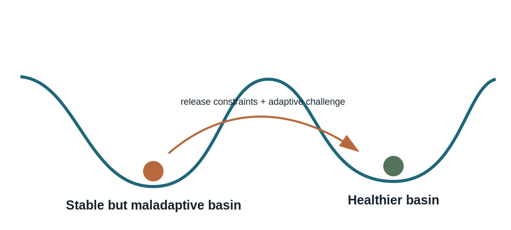
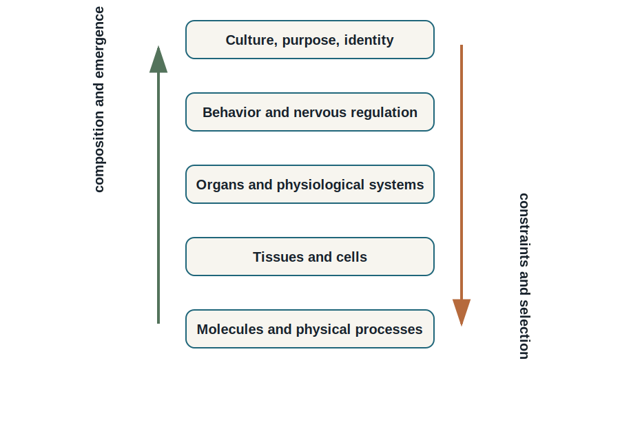
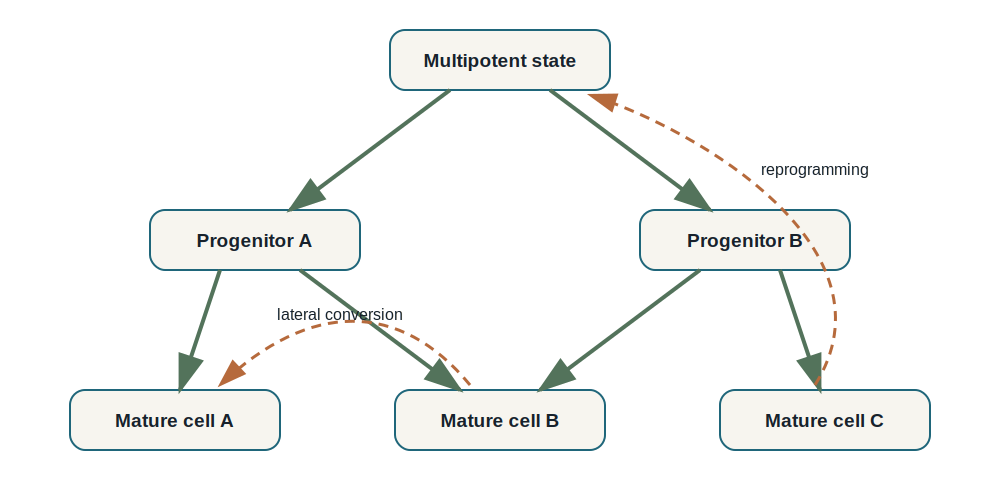
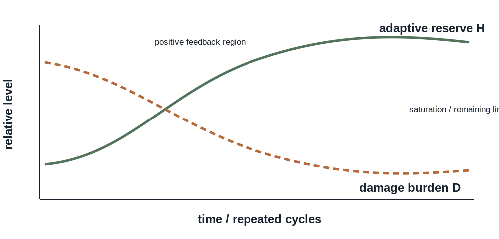

# The Self-Organizing Body

## A Systems View of Health, Adaptation, and the Possibility of Growing Young

**Jorge Simão**

**Version 0.3 — structural rewrite**

> This book develops a conceptual framework from more than twenty years of personal observation. It is not medical advice and does not establish that meditation, movement, fasting, or any other practice can regenerate a particular damaged organ. The argument is an invitation to research, not a reason to delay clinical care or to force the body through extreme practices.

## Preface — An Observation Looking for a Language

I began with no theory of aging and no ambition to propose one. I began with Tai Chi, Qigong, meditation, and the ordinary curiosity of a person learning to pay attention to his own body.

Over years, a recurring observation became difficult to ignore. When deliberate muscular control decreased and the nervous system became quieter, the body did not become inert. It became active in a different way. Very small movements appeared without being consciously designed. Tension reorganized across the jaw, neck, rib cage, spine, and pelvis. Breathing changed. Posture changed. Some adjustments were accompanied by audible releases. More important than any single event was the direction of the process: what I experienced as accumulated compensation seemed to unwind, often toward a form and function that felt earlier, simpler, and more coherent.

The observation was not that one relaxation session produced a miracle. It was that the process appeared to continue for decades.

That raised a question for which the language of fitness, physiotherapy, or stress reduction seemed too small. What kind of system can keep reorganizing itself when conscious control steps aside? What does it mean for a body to preserve its identity while replacing its material? Why do some patterns of posture, pain, belief, and behavior become stable even when they are harmful? Could the dynamics that make aging self-reinforcing, at least in part, run in the opposite direction?

This book is the attempt to build a language adequate to those questions. It draws on complex systems, dynamical systems, systems biology, developmental biology, motor control, geroscience, and the philosophy of causation. The individual ideas are not mine. The river metaphor has a long history. Attractors, energy landscapes, downward causation, cell plasticity, autopoiesis, mechanotransduction, and longevity escape velocity all have established intellectual lineages. What is original, if anything is, lies in the particular synthesis and in the observations that demanded it.

The book therefore proceeds in an order different from a self-help manual. It first teaches the reader how to think about multilayer systems. It then turns to the special problem of living form: how cells differentiate, how bodies develop, and how organization survives turnover. Only after that foundation does it address human aging, longevity strategies, and the possibility of endogenous positive feedback. The personal story comes later, once the reader has the concepts needed to interpret it. Practice follows the story. The final sections turn outward to researchers and clinicians.

The aim is neither to prove immortality nor to defend a private doctrine. It is to make a persistent observation intelligible enough that it can be criticized, measured, and improved.

---

# Part I — Thinking in Systems

---

# Chapter 1 — The River and the Machine

Modern medicine inherited one of the most productive metaphors in intellectual history: the body as a machine. Machines have parts. Parts wear, break, clog, and fail. Once the faulty part is identified, it can be repaired, replaced, or bypassed. The metaphor helped make anatomy precise and disease localizable. It prepared the way for surgery, intensive care, prosthetics, antibiotics, imaging, and molecular therapies.

The metaphor is powerful because bodies really do have components whose failure matters. A severed tendon cannot be talked back into continuity. An infection may require an antimicrobial. A blocked artery may require urgent intervention. Any systems account that denies these facts is not holistic; it is simply wrong.

Yet a living body is also unlike a machine in the property that matters most: it makes and remakes itself. An embryo does not arrive as a kit of parts assembled by an external engineer. Cells divide, migrate, differentiate, sense their neighbors, respond to force and electrical gradients, and collectively generate an anatomy. Adult tissues continue to turn over, repair boundaries, learn from loading, and change future responses. The body is made of parts, but its order is not imposed only from outside.

A river gives us a second metaphor. The same river persists while its water changes. Its identity lies in a pattern of flow constrained by a source, a gradient, a channel, a watershed, weather, organisms, and human activity. When a river becomes polluted, one can remove waste downstream. One can also go upstream, stop the source of pollution, reopen blocked channels, restore wetlands, and allow the river's own dynamics to carry sediment and renew habitats.

These are not competing strategies. A river sometimes needs direct engineering. But the upstream question is different from the mechanical one. Instead of asking only *which damaged piece should be repaired?*, it asks *which conditions keep recreating the damage?*

Consider chronic tension in the jaw and neck. A local examination may reveal dental pathology, joint degeneration, muscle spasm, or nerve irritation. Those findings matter. A systems examination additionally asks why the pattern is reproduced each day. Vision, breathing, threat prediction, sleep, habitual posture, pain avoidance, work, and social stress may all contribute. Treating one muscle can be useful while leaving the watershed untouched.

This is the first principle of the book:

> **When a living system repeatedly recreates a problem, look not only for the defective component but for the organization that makes the problem stable.**

The river will return throughout the book, but it should not be made to carry more than it can. A body is not literally water flowing through a channel. The metaphor serves one purpose: to shift attention from static components to processes that preserve identity through change. Once that shift is made, we need the more exact language of complex systems.

{#fig:river-machine width=92%}

The conceptual lineage is broad. General systems theory argued that organization and relations could not always be understood by studying isolated components [@bertalanffy1968general]. Autopoiesis described living systems as networks that continually produce the components and boundaries that constitute them [@maturana1980autopoiesis]. Contemporary systems biology studies interactions, feedback, and network behavior rather than treating a molecular list as a complete explanation.

The machine metaphor remains indispensable. The error is to mistake an indispensable perspective for an exhaustive ontology. The body is a machine in some respects, a river in others, and finally something more demanding: a historically evolved, self-producing, multilayer adaptive system.

---

# Chapter 2 — How Complex Systems Become Stable

Before speaking about healthy attractors, we need to understand what an attractor is and why the idea is useful.

A system is anything whose state can change over time. The state of a pendulum can be described by its angle and velocity. The state of a population may include the number of organisms and available resources. The state of a body is vastly larger: positions, forces, chemical concentrations, electrical potentials, cell identities, neural activity, beliefs, and environmental relations.

The set of all states a system could occupy is called its **configuration space** or, when velocities and other dynamic variables are included, its **state space**. We cannot draw the full state space of a person. It has too many dimensions. But we can reason about its geometry.

Imagine a landscape of hills and valleys. A ball placed on a slope tends to roll downhill. The bottom of a valley is a stable state: small disturbances move the ball, but it returns. In dynamical-systems language, the valley represents a basin of attraction and the bottom represents an attractor.

The analogy becomes useful when behavior is repetitive. A person with chronic pain may repeatedly return to a guarded movement pattern. A society may return to familiar institutions after political shocks. An ecosystem may settle into one of several stable regimes. A neural network may converge on a pattern representing a memory. The material differs, but the abstract question is similar: which states are stable, and what determines transitions between them?

Physical energy landscapes provide the clearest intuition. Molecules often occupy local energy minima. A reaction may have a lower-energy product available, yet remain trapped because it must first cross an activation barrier. Heat, a catalyst, or another perturbation can make the transition possible. Protein folding is frequently described through a landscape containing many possible conformations and a smaller set of stable folds.

Living systems complicate the picture. They are open systems that consume energy and maintain themselves far from thermodynamic equilibrium. Their landscapes are not fixed. Cells change the environment that changes them; organisms alter their own constraints; learning reshapes which patterns are easy to revisit. An attractor in biology is therefore not merely a passive low-energy state. It may be an actively maintained pattern.

This leads to an important distinction between **stability** and **health**. A pattern can be stable because the system repeatedly reinforces it, not because it is desirable. Chronic inflammation, metabolic disease, learned helplessness, and a pain-guarding loop can all become stable. Stability tells us that a pattern reproduces itself. It does not tell us that the pattern serves the whole organism.

A transition requires enough change to make the old attractor lose its grip or to make another attractor more accessible. In bodily practice, relaxation and challenge may play complementary roles. Relaxation can release constraints that keep the system confined to one narrow solution. Challenge can supply the demand that makes a different solution necessary. Relaxation without challenge may produce comfort without adaptation; challenge without relaxation may deepen the old compensation.

{#fig:attractor width=88%}

The figure is conceptual, not a literal measurement of bodily energy. Its value is explanatory. It helps us ask what variables define the state, which feedbacks deepen a basin, what perturbation could enable escape, and whether a new state remains stable after the intervention ends.

Dynamical-systems approaches have been applied to motor coordination, neural activity, ecology, physiology, and resilience. The concept of critical slowing down, for example, describes how a system near a transition may recover more slowly from disturbances [@scheffer2009early]. In clinical gerontology, resilience is increasingly studied through recovery trajectories rather than static measurements alone [@gijzel2017resilience].

The practitioner need not calculate a high-dimensional landscape. But a scientist or clinician can operationalize the idea: measure how quickly gait, heart rate, glucose, cognition, or muscle activation returns after a standardized perturbation. A healthier organism may be distinguished not only by its resting state but by the shape of its return.

---

# Chapter 3 — Causation Across Levels

Complex systems are organized in levels. In a human society, individuals form teams, institutions, markets, and cultures. In a body, molecules form organelles, cells, tissues, organs, physiological systems, behavior, and a person embedded in a social world. Each level is made from lower-level components, but it also changes the conditions under which those components act.

Reductionism proceeds downward. To understand a fever, examine cytokines, immune cells, receptors, and pathogens. To understand muscle contraction, examine actin, myosin, calcium, and ATP. This strategy has been spectacularly successful because higher-level events must be physically implemented.

The mistake is to infer that implementation makes the lower level the only real cause.

Consider a company. A decision by its board may cause thousands of computers to run different software the next morning. Nothing supernatural occurred. The decision was implemented through emails, contracts, access controls, managers, and keyboards. Yet explaining every electron in the computers would not reveal why the change happened. The organizational decision altered boundary conditions for lower-level events.

George Ellis calls such effects **top-down causation**: higher-level structures select, constrain, or enable lower-level processes [@ellis2012topdown]. Denis Noble's principle of **biological relativity** makes a related point: biology has no universally privileged level of causation [@noble2012biological]. A gene can influence behavior, and behavior can influence gene expression. The causal arrows form loops.

In a body, a sentence such as “I will train for a marathon” can become biological. The sentence is not a molecule. It is a high-level commitment. It changes a calendar, sleep, food, social relations, attention, repeated motor output, endocrine signals, blood flow, mechanical loading, and gene expression. The commitment reaches cells because the person reorganizes the conditions in which those cells live.

This is downward causation without mysticism. Beliefs do not violate physics. They are patterns instantiated in nervous systems and social relations that constrain what physical actions occur next.

The same logic operates in the opposite direction. An inflammatory signal alters mood. Sleep loss changes judgment. Pain changes identity. Causation is circular because levels continually modify one another.

{#fig:hierarchy width=82%}

The concept becomes useful when it prevents two errors. The first is molecular reductionism: assuming that only an intervention delivered as a drug or gene therapy is biologically deep. A social role, a long project, a movement practice, or an expectation can generate molecular effects through long causal chains. The second error is holistic vagueness: invoking “mind over matter” without specifying any pathway. A serious top-down account must identify the intermediate mechanisms.

Pain offers a concrete example. A prediction of danger can produce anticipatory bracing. Bracing alters force distribution and sensory feedback. The new sensations confirm the prediction, deepening the attractor. Safe exposure, skill, and a revised interpretation can reverse part of the loop. This does not mean all pain is psychological. It means that in systems containing perception and action, interpretation is one causal variable among others.

The broader implication is that longevity cannot be reduced to molecules alone. A person's work, identity, family, culture, and expectations shape daily behavior for decades. Their effects are diffuse and difficult to randomize, but difficulty of measurement is not evidence of causal irrelevance.

---

# Chapter 4 — Organization, Information, and Identity

If the material of a body changes, what exactly persists?

The question resembles the Ship of Theseus: if every plank is replaced, is it the same ship? Living systems make the puzzle unavoidable because replacement is not hypothetical. Proteins turn over. Blood cells are renewed. Bone is remodeled. Synapses change. Yet the organism preserves a recognizable history and form.

One answer is that identity resides partly in **organization**: relations that are maintained or reconstructed across material turnover. Organization is not independent of matter, but it is not reducible to a list of components either. The same components arranged differently can produce a queue, a crowd, a market, or a riot. In a tissue, position and relation determine which signals a cell receives, which forces it bears, and which genes it expresses.

Neural representation provides an instructive example. A memory is not ordinarily stored in one neuron like a file in one drawer. It depends on distributed patterns of connectivity, excitability, timing, and reactivation. Individual synapses can change while aspects of the memory persist. Damage to a subset of the network may degrade recall without erasing the whole representation. Conversely, preserving every neuron would not preserve a memory if the relevant organization were destroyed.

This distinction between substrate and organization does not make substrate disposable. A distributed memory still needs neurons. But it changes how we think about restoration. If function is represented redundantly or degenerately, the system may recover through a different microscopic implementation.

Biologists use **degeneracy** to describe structurally different elements that can perform similar functions. The term does not mean deterioration. It refers to multiple ways of obtaining a viable outcome. Collateral blood vessels can partly compensate for a blocked route. Muscles can redistribute recruitment. Immune repertoires can recognize overlapping targets. Evolution rarely preserves one exact mechanism when several approximate solutions work.

This motivates the principle of **functional equivalence**:

> Restoration may not require recreating the exact historical microstructure if another organization can deliver the required function with sufficient fidelity.

The qualification matters. Approximation is adequate for some functions and disastrous for others. A high-precision visual pathway cannot be replaced by arbitrary neural activity. A heart rhythm must remain within tight limits. Functional equivalence is an empirical criterion, not a license to call any compensation regeneration.

The identity of a human also exists at several levels. Biological identity maintains boundaries, form, and physiological continuity. Psychological identity organizes memory, values, and expectations. Social identity locates the person in families, professions, and cultures. These levels can support one another, but they can also conflict.

The longevity paradox of identity arises here. People often imagine longevity as the preservation of the current self. Yet life survives through controlled change. A rigid psychological identity may resist new movement, new work, new relationships, or revised beliefs—the very adaptations that preserve biological resilience.

The adaptive alternative is not loss of self. It is continuity of purpose with flexibility of implementation. The river preserves a trajectory without preserving each water molecule. A resilient person may preserve commitments and relationships while repeatedly revising the habits and self-descriptions through which they are enacted.

---

# Part II — How Living Form Is Built and Rebuilt

---

# Chapter 5 — How a Body Builds Itself

A fertilized human egg contains no miniature skeleton, heart, or brain. From one cell, a body emerges through repeated division, signaling, migration, force, and differentiation. To understand claims about adult self-reorganization, we first need to understand how biological form is produced at all.

Early embryonic cells are initially capable of many fates. As development proceeds, cells respond to chemical gradients, contact with neighbors, mechanical stress, timing, and gene-regulatory networks. These interactions make some genes more likely to be expressed and others less accessible. A cell becomes muscle, nerve, bone, or epithelium not because it receives an isolated instruction but because it enters a stable regulatory and spatial context.

Conrad Waddington represented differentiation as an **epigenetic landscape**. A ball rolls down a branching terrain; each branch corresponds to a developmental fate [@waddington1957strategy]. The picture captures both plasticity and constraint. Early in development many routes remain open. Later, the ball sits in a deeper valley and changing lineage becomes difficult.

The classical diagram can suggest that differentiation is irreversible. Modern biology shows a more nuanced reality. Mature cells usually maintain stable identities, which is necessary for tissue function. But dedifferentiation, transdifferentiation, injury-induced plasticity, and experimental reprogramming demonstrate that the valleys are not always absolute prisons [@merrell2016plasticity; @tata2016cellular].

Yamanaka's reprogramming work showed that a small set of transcription factors could return differentiated cells toward pluripotency, revealing that much developmental potential remains encoded rather than physically erased [@yamanaka2010nuclear]. Partial reprogramming attempts to recover selected youthful features without fully erasing cellular identity. The opportunity is remarkable; so are the risks. Excessive plasticity can disrupt tissue architecture or contribute to cancer.

Development is not governed by genes alone. Cells also exchange bioelectric signals, experience forces, and construct extracellular matrices. Michael Levin's work emphasizes that collectives of cells can store and pursue large-scale anatomical outcomes through bioelectric networks [@levin2021bioelectric]. Whether one accepts every interpretation, the experiments make an important pedagogical point: the target of regulation can exist at a scale larger than an individual cell.

{#fig:lineage width=90%}

The adult body retains parts of this developmental machinery, but not necessarily with embryonic scope. Wound healing, bone remodeling, immune adaptation, and stem-cell niches demonstrate continuing construction. Other tissues show limited spontaneous replacement. The central research question is therefore not whether adults are plastic or fixed. It is which transitions remain accessible in each tissue, under which signals, and at what cost.

---

# Chapter 6 — Form as a Multiscale Memory

A body does more than produce cells. It places them in an anatomy.

This distinction is easy to miss. Increasing cell number is not regeneration. A useful structure requires the right cells, in the right positions, with the right polarity, blood supply, innervation, extracellular matrix, and relation to the rest of the organism. Unregulated proliferation is not youth; it is often cancer.

Where is anatomical order stored? The genome contributes molecular components and regulatory rules, but every cell contains nearly the same genome while adopting radically different roles. Positional information is distributed across chemical gradients, tissue geometry, bioelectric states, mechanical forces, and communication networks. Developmental form is therefore a kind of multiscale memory maintained by relations among cells.

Regeneration in animals reveals this vividly. A salamander limb does not merely produce a mass of cells. It reconstructs a patterned limb of appropriate size and orientation. Planarian fragments can rebuild complete bodies with correct proportions. These capacities vary greatly among species, but they demonstrate that biological systems can represent a target morphology and correct deviations toward it.

Human bodies show more limited but genuine examples. Bone remodels in response to load. Skin and liver repair. Peripheral nerves can regrow over distances under favorable conditions. Vessels adapt to demand. The immune system learns. The question is why these capacities are powerful in some tissues and weak in others.

Several constraints recur: loss of progenitors, inhibitory extracellular matrices, immune responses, insufficient vascularization, cancer suppression, and the difficulty of reconnecting complex circuits. Evolution does not maximize regeneration independently of other goals. A tissue that is too willing to change may lose identity or become malignant.

The idea of a **healthy attractor** becomes biologically meaningful here. Healthy human bodies vary, but they occupy a restricted region of possible morphologies. Development repeatedly produces bilateral organization, coordinated joints, a characteristic organ layout, and functional proportions despite genetic and environmental variation. The healthy form is not one exact geometry; it is a basin of viable configurations.

When chronic compensation is reduced, adult structure may move toward that basin. This need not imply a hidden photograph of childhood. It requires only that current anatomy, developmental history, mechanical constraints, neural maps, and remaining regulatory networks make some forms easier to maintain than others.

“Recovering original shape” is therefore best understood as **recovering organization constrained by developmental history**. The claim is plausible for muscle tone, movement, connective tissue, and some bone remodeling. It becomes progressively more demanding when specialized cells have died or precise long-range connectivity has been lost.

---

# Chapter 7 — The Body Without a Central Engineer

The body solved organization long before a cortex existed.

Single cells regulate boundaries and repair. Multicellular organisms coordinated growth, movement, and regeneration before the evolution of reflective consciousness. Even in humans, most bodily control is distributed among autonomic circuits, spinal networks, peripheral nerves, local reflexes, endocrine signals, immune cells, and tissue-level mechanics.

Conscious control is powerful but narrow. It can choose a goal, focus attention, inhibit a response, or practice a movement. It cannot calculate the force in every muscle fiber required to stand. Motor control research increasingly treats movement as an interaction among goals, sensory feedback, task constraints, and abundant degrees of freedom rather than a sequence of fully specified commands [@todorov2002optimal; @latash2012bliss].

This changes the role of practice. A directive approach asks the person to hold the “correct” posture, contract a chosen muscle, or reproduce an externally defined shape. That approach can be clinically useful. But if the existing problem includes excessive co-contraction or top-down guarding, another command may become another constraint.

The complementary approach is to create conditions for distributed search. Slow movement reduces momentum and threat. Low force permits reversibility. Attention increases sensory resolution. Relaxation reduces unnecessary co-contraction. The conscious system maintains safety and intention while allowing lower-level control to discover how to satisfy physical constraints.

The process is not literally independent of the brain. “Letting the body decide” is shorthand for changing the balance among cortical intention, subcortical regulation, spinal and peripheral control, and tissue mechanics. The cortex becomes less of a micromanager and more of a context setter.

Small movements matter because the body is mechanically connected. A change in the jaw modifies forces through the skull and neck; breathing changes rib and spinal mechanics; foot pressure changes balance and proximal muscle recruitment. The exact propagation is individual and must not be romanticized. Audible cracking can be cavitation or tendon movement rather than healing. The relevant outcome is durable function, not drama.

This framework also explains why an externally guided therapy and a body-led practice need not be enemies. A therapist can remove a barrier, diagnose pathology, teach safety, or provide a useful perturbation. The patient's organism must still integrate the change. The deepest rehabilitation is not a shape imposed from outside but a capacity the system can reproduce when the therapist leaves.

---

# Chapter 8 — Plasticity, Repair, and Regeneration

The word *healing* hides several different biological events.

A person may recover function by compensation: remaining structures perform the task differently. Regulation may improve when inhibition or guarding is removed. Tissue may remodel under new loading. Repair may restore continuity with scar. Regeneration, in the strongest sense, reconstructs lost tissue with appropriate architecture and integration.

These distinctions matter because evidence for one does not automatically establish another. Improved gait does not prove cartilage regeneration. A changed face does not identify bone remodeling. Axonal regrowth from surviving neurons is different from replacing neurons that have died.

The optic nerve provides a useful boundary case. Retinal ganglion cells send axons from the eye to targets in the brain. Severe injury or glaucoma can kill cells, damage axons, disrupt myelin, and alter central targets. Restoring vision may require cell survival or replacement, long-distance growth, guidance, target selection, and functional integration.

A 2020 mouse study expressed Oct4, Sox2, and Klf4 in retinal ganglion cells and reported axonal regeneration and partial restoration of visual function in injury and aging models [@lu2020reprogramming]. The result matters because it shows that mature neuronal capacity is not absolutely fixed. It does not show that meditation, fasting, or systemic relaxation reproduces this intervention in humans.

The common objection that “the progenitor pool is gone” is therefore important but not always decisive. Restoration can sometimes use surviving mature cells, dedifferentiation, transdifferentiation, support-cell conversion, transplantation, or compensation by distributed circuits. The lineage tree is less irreversible than older diagrams suggested.

Still, every additional mechanism adds constraints. A theoretically possible transition may be inaccessible naturally, unsafe, or insufficiently precise. Cancer is the permanent shadow of regenerative ambition: the same loosening of identity that enables growth can threaten the organization it is meant to restore.

A responsible systems framework neither declares impossibility too quickly nor converts possibility into expectation. It asks a tissue-specific sequence of questions: What material remains? Which cell states are accessible? What guidance information survives? What prevents transition? What level of functional equivalence is sufficient? Which intervention can alter the barrier without destroying the whole?

---

# Part III — Aging, Longevity, and Practical Immortality

---

# Chapter 9 — Aging as Loss of Adaptive Capacity

Aging is often introduced as accumulated damage. The description is correct but incomplete. Damage matters partly because it reduces the capacity to respond to future damage.

The modern hallmarks framework describes interacting processes such as genomic instability, epigenetic alteration, loss of proteostasis, mitochondrial dysfunction, cellular senescence, stem-cell exhaustion, and altered intercellular communication [@lopezotin2013hallmarks; @lopezotin2023hallmarks]. The hallmarks are not isolated clocks. They reinforce one another.

Mitochondrial dysfunction can increase stress and reduce repair. Chronic inflammation can damage tissue and impair immune regulation. Senescent cells can alter neighboring cells through secreted factors. Frailty reduces activity; reduced activity accelerates muscle and cardiovascular decline. Poor sleep worsens metabolism and cognition, which may further impair sleep.

Human mortality over much of adult life approximately follows the Gompertz pattern: hazard rises exponentially with age [@gompertz1825nature]. The population-level law does not prove that each molecular defect grows exponentially. It is nevertheless consistent with a system in which losses of reserve make future failure increasingly likely.

This motivates a definition of aging centered on adaptation:

> **Aging is the progressive narrowing of the range of disturbances from which the organism can recover.**

A young organism is not merely less damaged. It often learns faster, heals more effectively, tolerates larger perturbations, and returns to function with less residual cost. An older organism may look stable at rest yet fail under a challenge that a younger system absorbs.

The clinical implication is that resilience should be measured dynamically. Instead of recording glucose once, observe recovery after a meal. Instead of measuring heart rate only at rest, examine response to exertion and return. Instead of treating cognition as a score, measure learning rate and recovery after sleep loss or stress.

The conceptual implication is equally important. If aging contains reinforcing loops, successful intervention should be judged by whether it improves the next response. The deepest outcome is not one better biomarker but **improved improvability**.

---

# Chapter 10 — Three Longevity Strategies

Contemporary longevity culture contains several strategies that are often treated as competitors but answer different questions.

The first is prevention and risk management. It includes exercise, sleep, vaccination, blood-pressure control, lipid management, cancer screening, social connection, and treatment of disease. Peter Attia's popular framing emphasizes extending healthspan by managing the major chronic causes of death and preserving physical capacity. Whatever one thinks of particular recommendations, this approach begins from epidemiology and clinical risk.

The second is measurement-driven optimization. Bryan Johnson turned himself into a highly visible experiment through Blueprint, publishing protocols, tracking extensive biomarkers, and iterating diet, sleep, exercise, devices, supplements, and medical interventions. His project is part quantified self, part longevity clinic, part public performance, and increasingly a commercial platform. Its strongest contribution is methodological: measure, intervene, compare, and publish. Its weakness is that one unusually resourced person cannot by himself establish general causality, and optimization of selected biomarkers may not equal whole-organism rejuvenation. His own public account of excessive leanness illustrates how improving one set of measures can worsen another dimension of perceived or functional health.

The third is damage repair. Aubrey de Grey argued that aging should be approached as an engineering problem: identify categories of accumulating damage and periodically repair them before pathology becomes irreversible. His Strategies for Engineered Negligible Senescence, or SENS, helped popularize a damage-oriented rejuvenation program. In a 2004 essay he introduced **actuarial escape velocity**, later widely called longevity escape velocity: if therapies extend healthy remaining life enough for improved therapies to arrive, the person may repeatedly stay ahead of age-related decline [@degrey2004escape].

These strategies can be placed in a simple relation:

- prevention reduces the rate at which damage is produced;
- measurement improves feedback and decision quality;
- rejuvenation engineering removes or repairs damage;
- the framework in this book asks whether endogenous organization can increase its own future maintenance capacity.

The final strategy does not replace the first three. A self-organizing body can still need antibiotics, surgery, a lipid-lowering drug, or future cell therapy. Conversely, external repair may work better in an organism with stronger circulation, movement, sleep, immune regulation, and adaptive reserve.

The most credible future is hybrid. Prevent avoidable damage. Measure what matters. Repair barriers the organism cannot cross. At the same time, investigate whether whole-system practice can shift the dynamics that generate, distribute, and respond to damage.

---

# Chapter 11 — Endogenous Escape Velocity

Longevity escape velocity is usually technological. Better therapies buy time for the next generation of therapies. The organism remains dependent on repeated external repair.

The parallel proposed here is **endogenous maintenance escape velocity**: a regime in which the organism's effective repair, clearance, and adaptation improve enough to exceed the rate at which damage and loss of reserve accumulate.

The idea must be formulated carefully. If repair exceeds damage by a fixed amount, damage falls linearly until it reaches a floor. Runaway improvement requires feedback: better health must increase the capacity to become healthier.

Let \(H(t)\) represent adaptive reserve and \(D(t)\) represent effective damage burden. A minimal conceptual model is

\[
\frac{dH}{dt}=A(H,L,R)-B(D,H),
\]

\[
\frac{dD}{dt}=G(H,t)-Q(H,R,D).
\]

Here \(L\) is adaptive load and \(R\) is recovery resource. \(A\) represents gains from appropriately dosed challenge and recovery. \(B\) represents losses imposed by damage and overload. \(G\) is new damage generation, and \(Q\) is repair or clearance.

The equations are not fitted biological laws. They force us to state the hypothesis. Positive feedback exists if a rise in \(H\) increases future \(A\) or \(Q\), or decreases \(G\). Negative feedback and saturation also matter. Excessive loading can reduce reserve. Repair mechanisms have finite capacity. Some damage may be inaccessible.

A plausible trajectory is therefore logistic rather than unbounded. Improvement may begin slowly while constraints remain, accelerate after a transition, and plateau near tissue-specific limits.

{#fig:reserve width=90%}

The testable prediction is second-order. A successful cycle should not only improve a state variable. It should improve the response to the next comparable challenge. If strength training, relaxation, sleep, and metabolic cycling increase adaptive reserve, later training and recovery should become more effective.

The strong claim—indefinite endogenous rejuvenation—has no human evidence. The weaker claim is already useful: interventions should be evaluated by whether they preserve or enlarge adaptive capacity, not merely by whether they temporarily improve a biomarker.

---

# Chapter 12 — The Distribution of Ages

Chronological age compresses a person into one number. Biological-age tests attempt to improve the estimate by combining biomarkers, but they often retain the same scalar assumption: the organism has one underlying age that a better instrument can reveal.

Bodies are more heterogeneous. Blood cells, gut epithelium, bone, muscle, neurons, immune memory, and extracellular matrix have different turnover rates and histories. One organ may function exceptionally well while another is diseased. A person can be cognitively flexible but physically frail, or muscularly strong but metabolically compromised.

It may therefore be more accurate to represent age as a distribution across tissues, functions, and timescales:

\[
P(a\mid i,t),
\]

where \(a\) is an effective age and \(i\) indexes a tissue or functional domain. The expression is deliberately abstract. Its purpose is to replace the intuition of one hidden age with a profile.

The idea extends beyond tissues. Human development produces age-associated modes of behavior: infant attachment, childhood play, adolescent exploration, adult responsibility, parental care, and elder perspective. Mature health may involve retaining access to several of these modes rather than permanently abandoning each one.

This is not a baby hidden inside an adult. Nor should embryonic proliferation be globally reactivated. The proposal is integrative: a person may remain capable of play without losing judgment, curiosity without losing commitment, and plasticity without losing identity.

Parenthood and grandparenthood offer a natural experiment. Adults crawl, carry, imitate, soothe, sing, play, teach, and perceive the world through another developmental stage. These interactions clearly alter behavior and often emotion and hormonal context. It is plausible that they preserve neural and motor repertoires that adult culture otherwise suppresses. It is speculative to infer broad cellular rejuvenation.

The distribution view has a practical consequence. A claim of rejuvenation based on one epigenetic clock or organ measure is incomplete. We should ask which dimensions became younger, which remained unchanged, and which worsened. The aim is not to optimize a single number but to preserve a broad, coherent portfolio of capacities.

---

# Part IV — A Twenty-Year Personal Experiment

---

# Chapter 13 — The Experiment I Did Not Plan

The conceptual framework came after the observation.

In the first years of Tai Chi, Qigong, and meditation, I was not attempting to reverse aging. I was learning practices that asked for a different relation to effort. Rather than making every movement happen through deliberate contraction, I was repeatedly asked to relax, attend, and allow coordination to emerge.

At first, relaxation meant doing less. Later it became more precise. I began to notice that voluntary effort was only one layer of control. Beneath it were reflexes, habitual contractions, balance corrections, breathing patterns, and protective responses that continued without conscious command.

When the central nervous system became quieter and I stopped imposing a desired posture, small movements appeared. They were not random in the ordinary sense. They often seemed to propagate through mechanically related regions. A change in the jaw was followed by the neck; a change in breathing altered the rib cage and spine; pressure redistributed through the pelvis and feet.

Some events produced loud cracks or releases. The sounds are easy to dramatize and scientifically weak on their own. Joint cavitation, tendon motion, and ordinary mechanical events can be audible. What kept my attention was not the sound but the repeated association with changes in ease, alignment, and function.

Across years, the process seemed to remove layers of compensation. I did not experience the body inventing an exotic new form. I experienced it converging toward a more symmetric, earlier, and less defended organization. “Recovering original shape” became the simplest description, though it should not be read as restoration of an exact childhood blueprint.

The duration changed the meaning of the observation. A short-term improvement could be relaxation, expectation, or ordinary motor learning. A process that continues for decades suggests either a long sequence of compensations being revised or a much larger adaptive domain than conventional expectations allow.

This remains an N-of-1 account. Memory is fallible. Aging, dental changes, body composition, work, and unrelated health changes can be misattributed. The observation earns the right to generate hypotheses, not to establish general efficacy.

---

# Chapter 14 — The Body as Observatory

An observatory does not create the stars it studies. It creates conditions in which weak signals become visible.

The body can be used in a similar way. Slow practice reduces noise from momentum and effort. Repetition reveals which sensations recur. Attention distinguishes a transient event from a durable transition. The practitioner becomes both participant and instrument.

This method has obvious weaknesses. Expectation changes perception. The observer is not blinded. Narrative can make unrelated events appear coherent. Yet first-person observation has a legitimate role in discovery. Pain, effort, balance, and proprioception are partly available only from inside. Clinical science routinely depends on subjective reports while seeking objective correlates.

The discipline is to separate observation from interpretation. “I heard a crack” is an observation. “My cervical vertebra permanently realigned” is an anatomical inference. “My body is regenerating” is a much larger theoretical claim. Each step requires additional evidence.

A useful record therefore includes timing, context, sensation, functional change, and persistence. Standardized photographs can test visible morphology. Range-of-motion measures, gait, force, EMG, dental assessment, ultrasound, or clinically indicated imaging can address specific mechanisms. Audio can document event frequency but cannot identify the tissue source alone.

The body observatory also changed my beliefs. Cultural and family expectations had defined what adult bodies do, what aging looks like, and which experiences are plausible. Repeated bodily discoveries sometimes contradicted those expectations. The mental trajectory was not adoption of a new doctrine but gradual willingness to question inherited limits.

This is where biological identity comes before psychological identity. The body supplies evidence that the self-description must accommodate. A rigid identity dismisses the evidence to preserve continuity. An adaptive identity allows the evidence to revise what the person believes possible.

---

# Part V — The Self-Organizing Practice

---

# Chapter 15 — What Practice Means

Only now can we define the “practitioner” addressed by this book.

A practitioner is not necessarily a follower of one school. The practice is the deliberate cultivation of adaptive capacity across levels of the organism. Tai Chi, Qigong, meditation, strength training, walking, difficult intellectual work, relationships, sleep, and nutrition can all contribute, but none is sacred.

The practice has four recurring movements.

First, **attention**. The person learns to observe without immediately forcing an interpretation or correction. Attention increases the resolution of feedback.

Second, **release**. Unnecessary muscular, cognitive, and identity constraints are allowed to soften. Release is not collapse. It preserves safety and intention while reducing micromanagement.

Third, **challenge**. The organism encounters demands slightly beyond its current stable repertoire. Physical training challenges force and coordination. An ambiguous project challenges models, beliefs, and identity. Social responsibility challenges emotional regulation and purpose.

Fourth, **integration**. Sleep, nourishment, rest, low-intensity movement, and time allow adaptation to become reproducible rather than episodic.

These movements form a cycle rather than a checklist. Challenge without release can deepen compensation. Release without challenge can become passive comfort. Recovery without adequate stimulus produces no new capacity. Stimulus without recovery produces decline.

The guiding principle is not maximal stress but maximum **integrable** challenge: the largest demand from which the whole organism can recover with greater future capacity.

---

# Chapter 16 — Systemic Progressive Loading

Progressive overload is familiar in physical training. A muscle adapts when repeatedly exposed to a demand beyond its accustomed level, provided recovery and material resources are sufficient.

The same abstract pattern appears in learning, emotional regulation, and social development. A difficult project forces new skills. An honest relationship exposes defensive habits. Parenthood expands responsibility. Meditation reveals impulses that ordinary distraction hides.

**Systemic progressive loading** applies this principle to the hierarchy of the person. The load is not merely heavier weight. It may be a project too ambiguous for the current belief system. To complete it, the person must learn what the problem is, create criteria, tolerate uncertainty, reorganize time, collaborate, and become someone capable of the work.

The cascade is top-down and bottom-up. A project changes identity and attention. Those change behavior, sleep, movement, stress, and physiology. Physical fatigue changes cognition and emotional tolerance. No single level controls the adaptation.

The concept is especially relevant to longevity because avoidance narrows adaptive bandwidth. A person stops running, then stops walking far, then avoids stairs, then organizes life around avoiding exertion. The same contraction can occur cognitively and socially. The world becomes smaller because the organism becomes less able to absorb novelty.

Progressive loading attempts to reverse the contraction, but it contains a danger. Modern professionals often live under enormous load already. More challenge is not automatically adaptive. Control, meaning, recovery, and variability determine whether load expands the system or grinds it down.

A useful progression may therefore involve subtraction: fewer simultaneous obligations, deeper sleep, less identity investment in productivity, or the capacity to remain still. The next load is whichever challenge exposes the present bottleneck without destroying the resources required to learn from it.

---

# Chapter 17 — Growth, Cleanup, and Recovery

Longevity protocols often present exercise, fasting, sleep, and nutrition as independent items. A systems view asks how they alternate.

Exercise and other loads signal adaptation. Building requires amino acids, energy, micronutrients, blood supply, hormones, and sleep. Chronic restriction can undermine muscle, bone, immunity, and reproductive function even when some metabolic biomarkers improve.

Periods of lower nutrient signaling may support intracellular maintenance pathways, including autophagy. Autophagy is a process by which cells degrade and recycle damaged proteins and organelles; it is not synonymous with removing whole senescent cells [@levine2019autophagy]. Senescent-cell clearance often depends on immune recognition or targeted senolytic mechanisms.

The biological lesson is not “fast as much as possible.” It is that growth and maintenance solve different problems. Continuous anabolism can accumulate defective structure; continuous catabolism causes wasting. Organisms evolved rhythms: feeding and fasting, activity and sleep, stress and recovery.

The practice therefore uses cycles:

challenge creates a reason to adapt; nourishment supplies material; relaxation reduces obsolete constraints; sleep consolidates neural and physiological change; appropriate metabolic variation supports maintenance; the next challenge tests whether capacity increased.

No universal schedule follows from this concept. Age, frailty, medication, diabetes, pregnancy, eating-disorder history, and workload alter what is safe. The systems principle is coordination, not extremity.

---

# Part VI — An Invitation to Science and Medicine

---

# Chapter 18 — A Research Program

The framework becomes scientifically useful only when it produces measurements that distinguish it from simpler explanations.

The first research program concerns body-led reorganization. Experienced practitioners could be compared with active controls using EMG, motion capture, balance, gait, breathing, and standardized structural measures. The prediction is not merely greater flexibility but reduced unnecessary co-contraction and increased coordinated variability.

The second program concerns **improved improvability**. After an intervention period, participants would face a standardized new challenge. Does the trained group learn faster, recover sooner, or retain adaptation longer? This tests adaptive reserve rather than one endpoint.

The third program concerns systemic progressive loading. Well-defined cognitive tasks could be compared with meaningful ambiguous projects while tracking sleep, autonomic measures, cognition, stress, and behavior. The hypothesis is that appropriately bounded ambiguity develops model-building capacity; uncontrolled ambiguity produces allostatic overload.

The fourth program concerns age distributions. Instead of one biological-age score, longitudinal studies could assemble profiles across immune, vascular, muscular, cognitive, sensory, and epigenetic measures. The question is whether interventions compress dysfunction, widen adaptive repertoire, or merely optimize selected dimensions.

The fifth program concerns the personal observations themselves. A prospective N-of-1 protocol can standardize audio, photographs, movement, symptoms, dental measures, and clinically justified imaging. Independent blinded analysis should be used where possible.

The strongest claims are also the easiest to state as falsifiers. The framework weakens if long-term practitioners show no greater adaptive reserve than comparable active people; if apparent structural changes remain within measurement error; if relaxation-based practice offers no advantage beyond ordinary exercise and expectation; or if better baseline health does not improve future adaptation.

A productive collaboration would bring together systems biologists, motor-control researchers, geroscientists, rehabilitation clinicians, developmental biologists, dentists, statisticians, and experienced practitioners. The aim is not to validate a tradition. It is to discover what the organism is actually doing.

---

# Chapter 19 — Objections and Boundaries

A reader may reasonably object that the framework combines established mechanisms into a conclusion far larger than the evidence supports. That objection is correct if the conclusion is stated as proven rejuvenation.

Mechanotransduction shows that force alters cell behavior. It does not prove that relaxation rebuilds every tissue. Cell reprogramming shows that mature identity can be altered. It does not prove that lifestyle supplies the required factors. Distributed neural representation shows that function is not attached to one neuron. It does not show that a destroyed optic pathway can be reconstructed through approximate organization.

Another objection concerns evolutionary trade-offs. If broad regeneration were easily accessible, why would humans not use it automatically? Possible answers include cancer suppression, energy cost, loss of tissue identity, and the fact that natural selection prioritizes reproduction more than indefinite maintenance. These explanations keep the hypothesis open but do not establish it.

A further objection is methodological. Two decades of personal experience can deepen skill while also deepening confirmation bias. The story may be fully explained by ordinary motor learning, exercise, stress reduction, body composition, and selective memory. This alternative must be actively tested, not dismissed as insufficiently visionary.

The framework also creates practical risks. A person may reinterpret pathology as a healing crisis, force neck or jaw movements, fast excessively, reject treatment, or blame illness on insufficient identity fluidity. Such uses are not courageous extensions of the theory. They are failures to respect its uncertainty.

The best version of the argument is therefore neither “the body can regenerate everything” nor “adult structure is fixed.” It is this:

> Adult human plasticity is tissue-specific, constrained, and incompletely mapped. Whole-organism states can influence lower-level biology through real causal pathways. The magnitude, limits, and trainability of that influence deserve better longitudinal research.

---

# Part VII — The Grand Vision

---

# Chapter 20 — The Grand Vision: Growing Young by Continuing to Become

The ordinary human life course is culturally described as expansion followed by contraction. Children learn and transform. Adults stabilize identities, professions, and habits. Older people are expected to manage decline.

Biology gives partial support to this trajectory, but culture may deepen it. A person who believes that exploration belongs to youth progressively removes challenge, play, and novelty. The identity of being old becomes one of the constraints through which aging acts.

The alternative is not permanent adolescence or denial of mortality. It is a life organized around continued becoming.

The phrase **grow young** should therefore be interpreted carefully. Youth is not one body shape or one biomarker. It is a high capacity to reorganize in response to the world. Growing young means preserving or recovering that capacity while retaining the judgment, commitments, and history acquired with age.

The framework can now be summarized as a sequence.

A body is a multilayer self-producing system, not only a machine. Its stable patterns can be represented as attractors. Higher levels—identity, purpose, culture—constrain lower-level dynamics through ordinary physical pathways. Development shows that cells can collectively build form; adult plasticity shows that some of those capacities remain. Aging narrows adaptive reserve through reinforcing loops. Practice may release obsolete constraints, apply integrable challenges, and coordinate growth with recovery. If each cycle improves the capacity for the next cycle, positive feedback becomes possible.

External medicine remains essential. The grand vision is not purity from technology but partnership between endogenous organization and engineered repair. Technologies may remove barriers the body cannot cross. A better-organized body may make better use of those technologies.

The project is ultimately larger than longevity. It asks what kind of being a human can become when identity is stable enough to preserve meaning and fluid enough to permit transformation.

The river remains itself by flowing.
