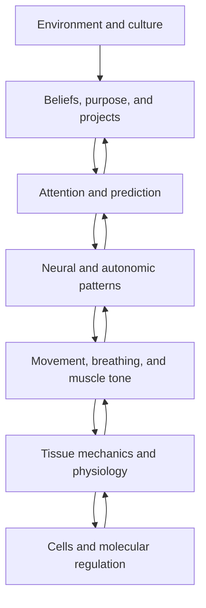
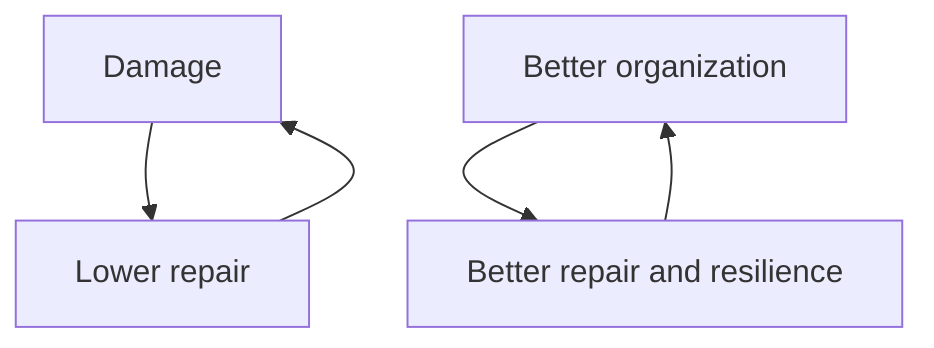

# Figure Specifications

## 1. The River and the Machine
Two panels: replace/repair components versus restore watershed and flow.

## 2. Bidirectional biological hierarchy

## 3. Healthy attractor landscape
A broad healthy basin surrounded by narrower maladaptive basins; arrows show perturbation, release, and convergence.

## 4. Relaxation releases degrees of freedom
Rigid motor state → expanded search → coordinated lower-effort solution.

## 5. Recursive adaptation

## 6. Negative and positive runway

## 7. Growth-cleanup-recovery cycle
Load → nourish/build → release → cleanup → sleep/integrate → test → progress.

## 8. Evidence ladder
Observation → functional measure → structural measure → physiological mechanism → replication.
